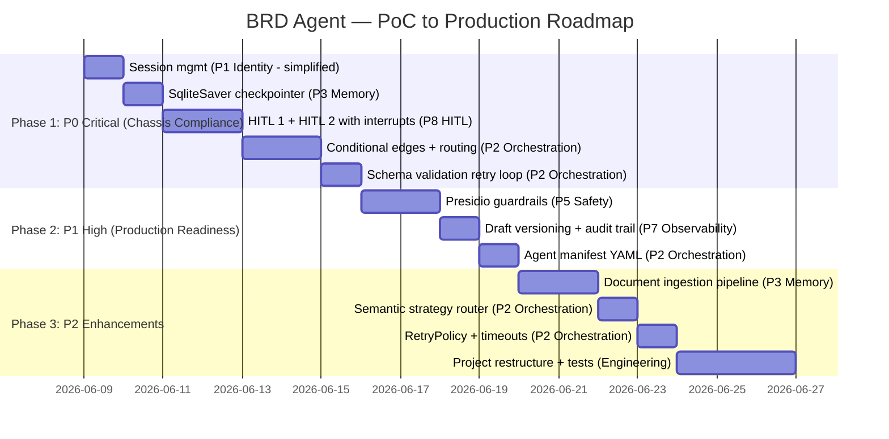

# BRD Agent — Deep Research Analysis (Aligned to MDP Chassis)

> **Scope:** Review of [BRD_AGENT_ARCHITECTURE.md](file:///e:/Coforge/NT/PoC/brd_agent/docs/BRD_AGENT_ARCHITECTURE.md) aligned to [MDP Agent Chassis Framework Design v1.0](file:///e:/Coforge/NT/PoC/brd_agent/docs/Team%20Docs/MDP_Agent_Chassis_Framework_Design_v1_0.txt) and [SOW MDP 2.0](file:///e:/Coforge/NT/PoC/brd_agent/docs/Team%20Docs/SOW%20MDP%202.0%20Agentic%20AI%20SDLC%20SOW%20Draft%20v5.txt).
>
> **Approach:** Every recommendation is tagged with its Chassis Plane mapping and a **PoC Now** (open-source) vs **Production Later** (Azure) path. Only items that are **necessary and feasible** with open-source alternatives are flagged for immediate implementation.

---

## How the Chassis Planes Map to Your BRD Agent

The Chassis Framework defines 8 capability planes. Below is how your current BRD Agent scaffold maps to each, and what needs to happen now vs. later.

| Chassis Plane | Production (Azure) | PoC Now (Open-Source) | Your Current State |
|:---|:---|:---|:---|
| **P1: Identity & Access** | Managed Identity + OBO tokens + Entra ID | Simple session token (request-scoped) | ❌ Global singleton, no auth |
| **P2: Orchestration & Routing** | LangGraph with durable checkpointing | LangGraph + SQLite checkpointer | ⚠️ Linear chains, no conditional edges |
| **P3: Memory & State** | Azure Cosmos/Redis + LangMem | SQLite checkpointer + InMemoryStore (LangMem) | ⚠️ MemorySaver (volatile) |
| **P4: Tool Access (MCP)** | MCP fleet via APIM egress | Direct retriever calls (correct per Chassis §3.3.1) | ✅ Correct — KG/VDB are direct, not MCP |
| **P5: Guardrails & Safety** | Presidio + Azure AI Content Safety | Presidio (open-source) | ❌ Not implemented |
| **P6: LLM Gateway** | APIM AI Gateway | Direct OpenAI/Ollama client | ⚠️ Direct client (fine for PoC) |
| **P7: Observability & AgentOps** | LangSmith + Azure Event Hub + Databricks | OpenTelemetry + Phoenix | ✅ Strong foundation |
| **P8: Human-in-the-Loop** | LangGraph interrupts + Agent Ops Portal | LangGraph interrupts + Streamlit | ❌ Documented but not wired |

---

## Scorecard — Reorganized by Chassis Plane

| # | Gap | Chassis Plane | PoC Priority | Can Do Now? |
|:---|:---|:---|:---|:---|
| 1 | Conditional edges + routing logic | P2: Orchestration | 🔴 P0 | ✅ Yes |
| 2 | Schema validation retry loop | P2: Orchestration | 🔴 P0 | ✅ Yes |
| 3 | HITL gates (interrupt_before/after) | P8: HITL | 🔴 P0 | ✅ Yes |
| 4 | Session management (multi-user) | P1: Identity | 🔴 P0 | ✅ Yes (simple) |
| 5 | Persistent checkpointer (SQLite) | P3: Memory & State | 🟠 P1 | ✅ Yes (SqliteSaver) |
| 6 | ~~Persistent memory store~~ | P3: Memory & State | ~~P1~~ | ⏸️ Deferred — InMemoryStore + checkpointer is sufficient |
| 7 | Draft versioning & audit trail | P7: Observability | 🟠 P1 | ✅ Yes |
| 8 | Input/output guardrails (Presidio) | P5: Guardrails | 🟠 P1 | ✅ Yes (Presidio is OSS) |
| 9 | Context strategy (semantic routing) | P2: Orchestration | 🟡 P2 | ✅ Yes |
| 10 | Document ingestion pipeline | P3: Memory & State | 🟡 P2 | ✅ Yes |
| 11 | Error handling (RetryPolicy) | P2: Orchestration | 🟡 P2 | ✅ Yes |
| 12 | Agent manifest / registry | P2: Orchestration | 🟡 P2 | ✅ Yes (JSON/YAML) |
| 13 | Project restructure + testing | Engineering | 🟡 P2 | ✅ Yes |
| ~~14~~ | ~~Golden dataset~~ | ~~SOW §5~~ | ~~P2~~ | ⏸️ Deferred — NT to provide later |

> [!NOTE]
> **Items NOT needed for PoC** (Production-only, requires Azure):
> - Managed Identity + OBO token chain (P1) — use simple session tokens for now
> - APIM AI Gateway (P6) — direct LLM client is fine for PoC
> - Azure Event Hub / Databricks telemetry pipeline (P7) — Phoenix is sufficient
> - MCP server fleet (P4) — BRD Agent doesn't call external SDLC tools
> - Azure AI Content Safety (P5) — Presidio alone covers the PoC

---

## Plane 2: Orchestration & Routing 🔴 P0

### What the Chassis Requires
> *"LangGraph is the production orchestration runtime... durable execution, persistent state, interrupts, and checkpointing as first-class features."* — Chassis §3.2
>
> *"Retry with backoff — automatic retry on transient tool or LLM failure, capped at 3 attempts."* — Chassis §3.2.1

### Gap 1: Conditional Edges (Linear → Decision Graph)

**Current:** Both graphs in [graph.py](file:///e:/Coforge/NT/PoC/brd_agent/backend/graph.py) are linear chains. No branching.

**Required:** The Chassis expects routing patterns (supervisor, router, fork/join, retry). Your BRD Agent needs at minimum:

#### A. Gathering Graph — Sufficiency Check Edge
```
START → summarize → retrieve_context → invoke_llm
                                          ↓
                              ┌─── route_after_conversation ───┐
                              ↓                                ↓
                        extract_memory                    hitl_gate
                              ↓                                ↓
                             END                         (interrupt → P8)
```

The routing function:
```python
def route_after_conversation(state) -> Literal["continue_gathering", "ready_for_hitl"]:
    """Pure routing function — inspects state only, no side effects."""
    if state.get("ready_for_production"):
        return "ready_for_hitl"
    return "continue_gathering"
```

**What to add to state:**
```python
class ChatbotState(TypedDict, total=False):
    # ... existing fields ...
    ready_for_production: bool    # NEW — set by invoke_llm
    retry_count: int              # NEW — for schema validation retries
    validation_errors: list[str]  # NEW — feed errors back to LLM
    pending_feedback: list[str]   # Already in architecture doc
    feedback_gathering: bool      # Already in architecture doc
```

#### B. Drafting Graph — Validation Retry Loop
```
START → retrieve_context → draft_llm → schema_validate
                                            ↓
                               ┌── route_after_validation ──┐
                               ↓              ↓             ↓
                              END          draft_llm    error_handler
                           (success)       (retry)      (max retries)
```

The routing function:
```python
MAX_RETRIES = 2

def route_after_validation(state) -> Literal["done", "retry", "error"]:
    if state.get("current_draft"):
        return "done"
    if state.get("retry_count", 0) < MAX_RETRIES:
        return "retry"
    return "error"
```

**On retry:** inject the Pydantic validation error back into the prompt so the LLM can self-correct. This aligns with Chassis §3.5: *"Pre-HITL self-check: agents validate their own artifacts against declared schemas before surfacing to a reviewer."*

#### C. Feedback Gathering Loop (Within Gathering Graph)
```
invoke_llm → route_feedback_status
                    ↓                    ↓
           extract_memory          hitl_gate
           (more feedback)         (user said "no more")
```

### Gap 9: Context Strategy — Semantic Router

**Current:** [strategy.py](file:///e:/Coforge/NT/PoC/brd_agent/backend/strategy.py) uses keyword matching. Brittle — *"I want to be compliant with GDPR"* triggers `COMPLIANCE_HEAVY`, but *"We need to follow privacy rules"* does not.

**PoC Fix (Open-Source):** Use the `semantic-router` library (pip-installable, uses local embeddings):

```python
from semantic_router import Route, SemanticRouter

routes = [
    Route(name="REFINEMENT", utterances=[
        "update the stakeholder section",
        "change the risk assessment",
        "I want to revise the scope",
    ]),
    Route(name="COMPLIANCE_HEAVY", utterances=[
        "we need to follow GDPR", "regulatory requirements apply",
        "SOX compliance is mandatory", "privacy rules",
    ]),
    # ... more routes with 5-10 examples each
]
router = SemanticRouter(routes=routes, encoder=FastEmbedEncoder())  # local, no API key
```

**Keep the cascading priority:**
1. Mode override (`drafting` → `BRD_GENERATION`) — **keep as-is**
2. Semantic router — **replace keyword matching**
3. Default → `INFORMATION_GATHERING` — **keep as-is**

### Gap 11: Error Handling (RetryPolicy)

**Current:** No retry on transient LLM/API failures. No timeouts.

**PoC Fix:** LangGraph has built-in `RetryPolicy`:
```python
from langgraph.pregel import RetryPolicy

g.add_node(
    "invoke_llm",
    _bind(invoke_llm, runtime),
    retry=RetryPolicy(max_attempts=3, initial_interval=1.0, backoff_factor=2.0),
)
g.add_node(
    "retrieve_context",
    _bind(retrieve_context, runtime),
    retry=RetryPolicy(max_attempts=2, initial_interval=0.5),
)
```

Also add timeout to LLM calls in [llm.py](file:///e:/Coforge/NT/PoC/brd_agent/backend/llm.py):
```python
self._client = AzureOpenAI(
    azure_endpoint=self.endpoint,
    api_key=self.api_key,
    api_version=self.api_version,
    timeout=60.0,  # NEW — prevent indefinite hangs
)
```

---

## Plane 8: Human-in-the-Loop 🔴 P0

### What the Chassis Requires
> *"Every agent is a doer; every human is a reviewer. This is a hard architectural invariant."* — Chassis §3.8
>
> *"Every HITL gate is a LangGraph interrupt, not an ad hoc branch."* — Chassis §3.2.2
>
> *"Artifacts always start in Draft state. After three rejection cycles the artifact escalates."* — Chassis §3.8

### Current State
HITL 1 and HITL 2 are documented in the architecture but **not wired** in code. No `interrupt_before`, no `interrupt_after`, no Draft→New state machine.

### PoC Implementation

#### HITL 1 — Pre-Production Gate
Use LangGraph's `interrupt()` function inside a dedicated `hitl_gate` node:

```python
from langgraph.types import interrupt

def hitl_gate(state, config, runtime):
    """Pause and present a summary for user approval before drafting."""
    summary = build_requirements_summary(state["brd_memory"])
    
    # This pauses the graph — frontend receives the summary
    approval = interrupt({
        "type": "hitl_1",
        "summary": summary,
        "action_required": "confirm_or_add_more",
    })
    
    if approval.get("action") == "add_more":
        return {"mode": "gathering", "feedback_gathering": True}
    return {}  # proceed to drafting
```

#### HITL 2 — Post-Production Review
Use `interrupt_after` on `schema_validate`:
```python
def build_drafting_graph(runtime):
    # ... existing nodes ...
    return g.compile(
        checkpointer=checkpointer,
        interrupt_after=["schema_validate"],  # pause after BRD is produced
    )
```

#### Draft State Machine (Chassis §3.8)
Add to `ChatbotState`:
```python
class DraftStatus(str, Enum):
    DRAFT = "draft"          # Just produced, awaiting review
    APPROVED = "approved"    # Reviewer approved (Draft → New in Chassis terms)
    REJECTED = "rejected"    # Reviewer rejected with feedback

class ChatbotState(TypedDict, total=False):
    # ... existing ...
    draft_status: DraftStatus
    rejection_count: int       # Track rejections (no hard cap for PoC)
```

> [!NOTE]
> **PoC Decision:** The Chassis mandates escalation after 3 rejections (§3.8). For the PoC, we track `rejection_count` for observability but do **not** enforce a hard cap or escalation. The 3-cycle limit will be enforced in the production environment. Infinite revision loops are allowed in the PoC.

---

## Plane 1: Identity & Access 🔴 P0 (Simplified for PoC)

### What the Chassis Requires (Production)
> *"Managed Identity via AKS Workload Identity... Chained OBO token carries the originating user identity."* — Chassis §3.1

### PoC Now — What We Actually Need
We don't need Entra ID, OBO tokens, or Managed Identities for the PoC. But we **must** fix the global singleton in [session.py](file:///e:/Coforge/NT/PoC/brd_agent/backend/session.py).

**Minimum viable change:**
```python
# Replace global _session with request-scoped session lookup

class ChatRequest(BaseModel):
    message: str = Field(min_length=1)
    session_id: Optional[str] = None  # Client passes existing or gets new one

@app.post("/chat")
def chat(body: ChatRequest):
    session_id = body.session_id or uuid4().hex
    # Graph invocation uses session_id as thread_id
    result = _gathering_graph.invoke(
        {"messages": [HumanMessage(content=body.message)], "mode": mode},
        config={"configurable": {"thread_id": session_id}},
    )
    return ChatResponse(reply=reply, mode=mode, session_id=session_id, ...)
```

**Move `approved` flag into `ChatbotState`** — it's graph state, not session state:
```python
class ChatbotState(TypedDict, total=False):
    # ... existing ...
    draft_status: DraftStatus    # NEW (replaces simple approved flag from SessionState)
    rejection_count: int         # NEW — tracked for observability, no hard cap in PoC
```

### Production Later
- Replace simple session_id with JWT token from Entra ID
- Add OBO token propagation per Chassis §3.1.1
- Scope MI per Chassis §3.1.2

---

## Plane 3: Memory & State 🟠 P1

### What the Chassis Requires
> *"KG/VDB vs MCP Separation: Knowledge Graph and Vector DB retrievals are direct agent calls via the LangChain retriever. They are not MCP."* — Chassis §3.3.1

✅ **Your design is correct here.** Chroma and Neo4j are called directly through the assembler, not through MCP. This matches the Chassis contract exactly.

### Gap 5: Persistent Checkpointer — SQLite

**Current:** `MemorySaver()` — volatile, single-process.

**PoC Decision: Use `SqliteSaver`** — zero-config, file-based, full feature parity with PostgresSaver for all features we need (HITL interrupts, state persistence, resume).

```python
# PoC (zero-config, file-based)
from langgraph.checkpoint.sqlite import SqliteSaver
checkpointer = SqliteSaver.from_conn_string("storage/checkpoints.db")
```

**SQLite limitations (acceptable for PoC):**
- Single writer at a time — fine for single uvicorn worker
- No horizontal scaling — not needed for PoC
- File-based — data persists across restarts, stored in `storage/` directory

**Production migration path:** Swap to `PostgresSaver` (same interface, one-line change).

### Gap 6: Memory Store — Keep InMemoryStore (With Checkpointer Safety Net)

**Current:** `InMemoryStore()` in [memory.py](file:///e:/Coforge/NT/PoC/brd_agent/backend/memory.py).

**PoC Decision: Keep `InMemoryStore`** — LangGraph does not provide a `SqliteStore`. However, this is a non-issue because:

1. `extract_memory` node writes to InMemoryStore via LangMem
2. It reads merged memory back into `state.brd_memory`
3. `state.brd_memory` **is persisted by SqliteSaver** (checkpointer)
4. On next turn, the assembler reads from `state.brd_memory`, not the store directly

So memory survives restarts through the checkpointed state. The only edge case: if the process restarts mid-session, LangMem's InMemoryStore is empty but `state.brd_memory` in the checkpoint still has the last snapshot.

**Still recommended improvements (independent of store backend):**
- Enable `enable_deletes=True` — user corrections should overwrite stale facts
- Enable `enable_updates=True` — contradictions should be resolved
- Separate namespaces: `("brd_agent", session_id, "memory")` vs `("brd_agent", session_id, "summary")` — more robust than field-signature discrimination

---

## Plane 5: Guardrails & Safety 🟠 P1

### What the Chassis Requires
> *"Guardrails are mandatory input-output wrappers on every LLM call. The chassis invokes Presidio before the prompt leaves and after the completion returns."* — Chassis §3.5
>
> *"Input guardrails: PII detection, prompt-injection heuristics, user scope validation."*
> *"Output guardrails: PII masking, content-safety review, schema conformance."*

### Current State
❌ No guardrails implemented. No Presidio. No PII detection.

### PoC Fix (Presidio is Open-Source!)
Microsoft Presidio is fully open-source and pip-installable. This is one of the easiest Chassis requirements to implement right now.

**PoC Entity Scope (decided):**

| Entity | Why | Action |
|:---|:---|:---|
| `CREDIT_CARD` | SOW explicitly mentions | Mask |
| `US_SSN` | SOW explicitly mentions | Mask |
| `PERSON` | SOW mentions "names" | Log only (don't mask — BRDs legitimately contain stakeholder names) |
| `EMAIL_ADDRESS` | Common in BRD context | Mask |
| `PHONE_NUMBER` | Can appear in contact sections | Mask |
| `US_BANK_NUMBER` | Financial services context (NT) | Mask |
| `IBAN_CODE` | Financial services context (NT) | Mask |
| `IP_ADDRESS` | Can appear in NFRs | Log only (don't mask — NFRs may reference IPs legitimately) |

> [!NOTE]
> **Design decision on PERSON entity:** BRDs *legitimately* contain stakeholder names ("John Smith, VP of Operations"). Masking all names would break the document. Instead, we **log** PERSON detections for audit but do **not** mask them. Only financial identifiers (SSN, credit cards, bank numbers) and contact details (email, phone) are actively masked.

```python
# backend/guardrails/presidio.py
from presidio_analyzer import AnalyzerEngine
from presidio_anonymizer import AnonymizerEngine

analyzer = AnalyzerEngine()
anonymizer = AnonymizerEngine()

# Entities to actively MASK in prompts and outputs
MASK_ENTITIES = ["CREDIT_CARD", "US_SSN", "EMAIL_ADDRESS", "PHONE_NUMBER",
                 "US_BANK_NUMBER", "IBAN_CODE"]
# Entities to LOG but NOT mask (legitimate in BRD context)
LOG_ONLY_ENTITIES = ["PERSON", "IP_ADDRESS"]
ALL_ENTITIES = MASK_ENTITIES + LOG_ONLY_ENTITIES

def scan_and_protect(text: str) -> tuple[str, list[dict], list[dict]]:
    """Scan text for PII. Returns (cleaned_text, masked_findings, logged_findings)."""
    all_results = analyzer.analyze(text=text, language="en", entities=ALL_ENTITIES)
    
    mask_results = [r for r in all_results if r.entity_type in MASK_ENTITIES]
    log_results = [r for r in all_results if r.entity_type in LOG_ONLY_ENTITIES]
    
    if mask_results:
        anonymized = anonymizer.anonymize(text=text, analyzer_results=mask_results)
        return anonymized.text, [r.to_dict() for r in mask_results], [r.to_dict() for r in log_results]
    return text, [], [r.to_dict() for r in log_results]
```

**Integration points:**
1. Before `invoke_llm`: scan user message
2. After `invoke_llm`: scan reply before returning to user
3. Before `draft_llm`: scan assembled context
4. After `schema_validate`: scan generated BRD

> [!IMPORTANT]
> **SOW §7 Critical Assumption:** *"PII/PCI data should not be uploaded to any LLM."* Presidio is the first line of defense. This should be P1, not P2.

---

## Plane 7: Observability & AgentOps 🟠 P1

### Current State
✅ **Strong foundation.** [telemetry.py](file:///e:/Coforge/NT/PoC/brd_agent/backend/telemetry.py) has OpenTelemetry + Phoenix with a well-defined span contract. This maps well to Chassis §3.7.

### Gap 7: Draft Versioning & Audit Trail

**Chassis requires:**
> *"LangSmith captures full execution traces under a WORM policy with 7-year retention."* — Chassis §3.7

For PoC, we can't do 7-year WORM retention, but we **can** implement the draft versioning that makes auditing possible.

**Add to state:**
```python
class ChatbotState(TypedDict, total=False):
    # ... existing ...
    draft_history: Annotated[list[dict], add_items]  # append-only via reducer
```

**Each draft entry:**
```python
draft_entry = {
    "version": version_number,
    "draft": brd.model_dump(mode="json"),
    "produced_at": datetime.utcnow().isoformat(),
    "prompt_hash": assembled.prompt_template_hash,
    "context_strategy": assembled.strategy.value,
    "model": runtime.llm.model,
    "token_accounting": assembled.token_accounting.model_dump(),
    "status": "draft",  # draft → approved → rejected
    "reviewed_by": None,
    "reviewed_at": None,
}
```

**New API endpoints:**
```
GET  /drafts              → list all draft versions for current session
GET  /drafts/{version}    → specific version with full provenance
```

### Gap 12: Agent Manifest (Lightweight Version)

**Chassis requires:** Every agent declares a manifest with tool scope, prompt template, reviewer role, and domain outputs (§4).

**PoC Fix:** Create a simple YAML manifest file:

```yaml
# backend/manifest.yaml
agent_id: "brd-agent"
version: "0.1.0"
display_name: "Business Requirements Document Agent"
domain: "requirements"
capabilities:
  - requirement_elicitation
  - brd_generation
  - brd_revision
tools:
  - chroma_vector_store    # direct retriever (not MCP)
  - neo4j_knowledge_graph  # direct retriever (not MCP)
  - fetch_brd_template     # artifact tool
prompts:
  gathering: "brd-gathering@0.1.0"
  drafting: "brd-drafting@0.1.0"
  summarize: "brd-summarize@0.1.0"
hitl_gates:
  - hitl_1: "pre-production approval"
  - hitl_2: "post-production review"
reviewer_role: "Business Analyst / Product Owner"
max_rejection_cycles: 3
output_schema: "BRDResponse"
llm_preference: "gpt-4o"  # hint; gateway governs actual selection
guardrail_profile: "presidio-default"
status: "active"  # draft | registered | certified | active | deprecated | retired
```

This is a **documentation and configuration** artifact for now. In production, it moves to the Agent Registry (PostgreSQL → API Center per Chassis §4.1).

---

## Plane 4: Tool Access — No Changes Needed ✅

Your BRD Agent correctly treats KG and VDB as **direct retriever calls**, not MCP. This matches Chassis §3.3.1:

> *"Knowledge Graph and Vector DB retrievals are direct agent calls via the LangChain retriever. They are not MCP. MCP is reserved for external SDLC tools."*

The BRD Agent has no external SDLC tool integrations (no ServiceNow, no ADO, no GitHub). The `fetch_brd_template` tool is internal. **No MCP changes needed.**

---

## Plane 6: LLM Gateway — No Changes Needed for PoC ✅

**Production:** All LLM traffic must flow through APIM AI Gateway (Chassis §3.6). The gateway enforces token budgets, model routing, and cost tracking.

**PoC:** Direct client to Azure OpenAI / Ollama is fine. Your [llm.py](file:///e:/Coforge/NT/PoC/brd_agent/backend/llm.py) abstraction layer (`BaseLLMClient` → `AzureOpenAIClient` / `OllamaClient`) is well-designed for eventual gateway swap — just change the endpoint.

**One PoC improvement:** Add model version pinning to span attributes (for audit):
```python
# In llm.py complete():
span.set_attribute("llm.model_version", self.deployment)  # e.g., "gpt-4o-2024-05-13"
```

---

## Gap 10: Document Ingestion Pipeline 🟡 P2

### Current State
Architecture doc mentions document ingestion, but no code exists. No `/upload` endpoint.

### PoC Fix (Open-Source)
```python
# backend/ingestion/parser.py
from langchain_community.document_loaders import PyMuPDFLoader
from langchain_text_splitters import RecursiveCharacterTextSplitter

splitter = RecursiveCharacterTextSplitter(chunk_size=1000, chunk_overlap=200)

def parse_and_chunk(file_path: str) -> list[Document]:
    loader = PyMuPDFLoader(file_path)
    docs = loader.load()
    return splitter.split_documents(docs)
```

```python
# New endpoint in main.py
@app.post("/upload", status_code=202)
async def upload_document(
    file: UploadFile,
    session_id: str = Query(...),
    background_tasks: BackgroundTasks,
):
    job_id = uuid4().hex
    saved_path = save_upload(file, job_id)
    background_tasks.add_task(ingest_document, saved_path, session_id, job_id)
    return {"job_id": job_id, "status": "processing"}
```

> [!NOTE]
> **SOW §7:** *"Document inputs for all agents are text-based. Image and diagram parsing is not supported."* This simplifies the ingestion pipeline — text extraction only, no OCR or vision.

---

## Gap 13: Project Structure & Testing 🟡 P2

### Recommended Structure

```
backend/
├── __init__.py
├── api/                    # FastAPI endpoints (extracted from main.py)
│   ├── __init__.py
│   ├── chat.py
│   ├── drafting.py
│   ├── review.py
│   └── upload.py
├── core/                   # Core domain logic
│   ├── __init__.py
│   ├── graph.py
│   ├── schema.py
│   ├── state.py            # ChatbotState, reducers, enums
│   └── manifest.yaml       # Agent manifest (Chassis P2)
├── memory/                 # Memory management
│   ├── __init__.py
│   ├── manager.py
│   └── schemas.py
├── context/                # Context assembly
│   ├── __init__.py
│   ├── assembler.py
│   ├── strategy.py
│   └── prompts.py
├── guardrails/             # NEW — Presidio integration (Chassis P5)
│   ├── __init__.py
│   └── presidio.py
├── ingestion/              # NEW — Document ingestion pipeline
│   ├── __init__.py
│   ├── parser.py
│   └── chunker.py
├── nodes/                  # Graph nodes
├── sources/                # Retrieval sources (VDB, KG)
├── tools/                  # Agent tools
├── telemetry.py
└── llm.py

tests/
├── unit/
│   ├── test_strategy.py
│   ├── test_schema_validate.py
│   ├── test_context_assembler.py
│   ├── test_guardrails.py
│   └── test_memory.py
├── integration/
│   ├── test_gathering_graph.py
│   └── test_drafting_graph.py
└── conftest.py
```

> [!NOTE]
> **Golden dataset deferred.** SOW §5 requires ≥20 curated input-output pairs for acceptance testing. This is an NT responsibility and will be addressed in a later phase. The `tests/golden_dataset/` directory and evaluation harness will be added when the dataset is available.

---

## What's Already Strong ✅

| Pattern | Chassis Alignment | Assessment |
|:---|:---|:---|
| 3-State FSM with HITL gates | P8 ✅ | Matches Draft→Review→Approve lifecycle |
| Dual-Graph Design | P2 ✅ | Clean separation of concerns |
| Context Assembler (single seam) | P2 ✅ | Exactly what the Chassis expects |
| KG/VDB as direct retrievers | P4 ✅ | Correct per Chassis §3.3.1 |
| OpenTelemetry + Phoenix | P7 ✅ | Drop-in replacement for LangSmith later |
| Prompt versioning via hash | P7 ✅ | Enables regression detection |
| LLM provider abstraction | P6 ✅ | Easy gateway swap later |
| Rolling summary + RemoveMessage | P3 ✅ | Canonical LangGraph pattern |
| Structured memory extraction | P3 ✅ | Best-in-class with LangMem |

---

## Implementation Order — Aligned to Chassis



---

## Locked Decisions ✅

| # | Decision | Choice | Rationale |
|:---|:---|:---|:---|
| 1 | **Checkpointer** | SQLite (`SqliteSaver`) | Postgres is used by another app; SQLite has full feature parity for single-worker PoC |
| 2 | **LangMem Store** | Keep `InMemoryStore` | No `SqliteStore` exists; memory survives via checkpointed `state.brd_memory` |
| 3 | **Streamlit HITL UX** | Simple buttons ("Proceed" / "Add More") | Keep it minimal for PoC |
| 4 | **Rejection limit** | No hard cap; track `rejection_count` for observability only | 3-cycle escalation is a production env concern, not PoC |
| 5 | **Presidio entities** | Mask: SSN, credit cards, bank numbers, email, phone. Log-only: person names, IPs | BRDs legitimately contain stakeholder names — masking would break the document |
| 6 | **Golden dataset** | Deferred | NT to provide in a later phase; not blocking PoC work |
