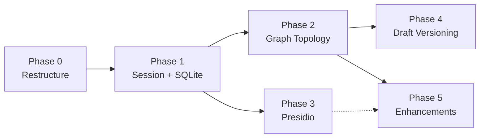

# BRD Agent v2.0 — Master Implementation Plan

> **Scope:** Upgrade the existing BRD Agent scaffold to match the v2.0 Architecture (Chassis-Aligned).  
> **Approach:** Phase-by-phase. Each phase gets its own detailed plan before execution.  
> **Tracking:** Discrepancies found during implementation are logged in [discrepancy_notes.md](discrepancy_notes.md).  
> **Self-contained:** This document provides all context needed for an agent with no prior knowledge to pick up and execute.

---

## 1. Project Context

### What is the BRD Agent?
A **3-state conversational AI system** that guides a user through eliciting business requirements and produces a structured, schema-validated **Business Requirements Document (BRD)**. It is being built as a PoC for the **MDP Agent Chassis Framework** at NT (a Coforge financial services client).

### Three States
1. **🟡 Agent Interaction** — Multi-turn conversation: ingest documents, ask clarifying questions, collect feedback
2. **🟢 BRD Production** — Atomic generation/update of the BRD document using all gathered context
3. **🔵 Review Mode** — User reviews the BRD, approves or requests changes (loops back to 🟡)

### Two HITL Gates
- **HITL 1:** Between 🟡 and 🟢 — agent presents a summary, user confirms before production
- **HITL 2:** Between 🟢 and 🔵 — user reviews the BRD, accepts or requests changes

### Tech Stack
| Layer | Technology |
|:---|:---|
| Backend | Python, FastAPI, Uvicorn |
| LLM Orchestration | LangGraph (StateGraph), LangChain |
| Memory | LangMem (MemoryStoreManager), InMemoryStore |
| LLM Providers | Azure OpenAI, Ollama (local) |
| Vector DB | ChromaDB (ONNX MiniLM-L6-v2 embeddings) |
| Knowledge Graph | Neo4j 5 (Docker) |
| Observability | OpenTelemetry + Arize Phoenix |
| Frontend | Streamlit |
| Validation | Pydantic v2 |

### Governance Constraints (from SOW)
- All agent outputs are **drafts subject to human review**
- **PII/PCI data must not be uploaded to any LLM** (SOW §7)
- Document inputs are **text-only** — no image/diagram parsing (SOW §7)
- KG/VDB are **direct retriever calls, not MCP** (Chassis §3.3.1)

---

## 2. Current Codebase Map

```
brd_agent/
├── backend/
│   ├── __init__.py
│   ├── main.py                    # FastAPI app — ALL endpoints defined here (monolith)
│   ├── graph.py                   # Two LangGraph StateGraphs (gathering + drafting) — LINEAR chains
│   ├── schema.py                  # Pydantic models: BRDResponse, BRDMemory, ConversationSummary
│   ├── session.py                 # SessionState class — GLOBAL SINGLETON (to be replaced)
│   ├── memory.py                  # LangMem MemoryStoreManager — uses InMemoryStore
│   ├── context_assembler.py       # ContextAssembler.assemble() — builds LLM prompt stack
│   ├── strategy.py                # ContextStrategy enum + infer_strategy() — KEYWORD-BASED
│   ├── prompts.py                 # System prompts for gathering, drafting, update, summarize
│   ├── llm.py                     # BaseLLMClient, AzureOpenAIClient, OllamaClient
│   ├── artifacts.py               # ArtifactStore — in-memory dict for large tool outputs
│   ├── telemetry.py               # OpenTelemetry + Phoenix setup, span helpers
│   ├── nodes/
│   │   ├── summarize.py           # Summarize oldest messages into ConversationSummary
│   │   ├── retrieve_context.py    # Calls ContextAssembler, queries Chroma + Neo4j
│   │   ├── invoke_llm.py          # Chat completion for gathering mode
│   │   ├── extract_memory.py      # LangMem extraction from last 2 messages
│   │   ├── draft.py               # draft_llm — JSON mode LLM call for BRD generation
│   │   └── schema_validate.py     # Pydantic validation — CURRENTLY RAISES ON FAILURE
│   ├── sources/
│   │   ├── base.py                # BaseRetriever interface
│   │   ├── vector_store.py        # ChromaRetriever
│   │   └── kg.py                  # Neo4jRetriever
│   └── tools/
│       └── fetch_brd_template.py  # Template fetching tool
├── frontend/
│   └── streamlit_app.py           # Streamlit UI — basic chat interface
├── docs/
│   ├── BRD_AGENT_ARCHITECTURE.md  # *** v2.0 ARCHITECTURE SPEC (SOURCE OF TRUTH) ***
│   ├── diagrams/                  # 7 Mermaid diagram files (all updated to v2.0)
│   │   ├── simplified_brd_agent_flow.md
│   │   ├── detailed_flow.md
│   │   ├── state_flow.md
│   │   ├── gathering_graph.md
│   │   ├── drafting_graph.md
│   │   ├── context_assembly.md
│   │   └── memory_lifecycle.md
│   └── Team Docs/                 # NT governance docs (gitignored, not in repo)
│       ├── MDP_Agent_Chassis_Framework_Design_v1_0.txt
│       └── SOW MDP 2.0 Agentic AI SDLC SOW Draft v5.txt
├── infra/
│   └── docker-compose.yml         # Neo4j container
├── scripts/
│   ├── run.ps1 / run.sh           # Start backend + frontend
│   ├── setup.ps1                  # Environment setup
│   ├── seed_chroma.py             # Seed vector store with templates/glossary
│   ├── seed_neo4j.py              # Seed knowledge graph with enterprise data
│   ├── smoke_chat.py              # Smoke test: full chat flow
│   ├── smoke_llm.py               # Smoke test: LLM connectivity
│   └── smoke_memory.py            # Smoke test: memory extraction
├── test/
│   ├── demo_prompt.md             # Demo scenario
│   ├── trace_contract.md          # Telemetry span contract
│   └── test_ollama.ipynb          # Ollama test notebook
├── storage/                       # Gitignored — will hold SQLite DB
├── Implementation Plan/           # This folder
│   ├── master_implementation_plan.md  ← YOU ARE HERE
│   ├── discrepancy_notes.md
│   └── phase_X_plan.md            # Created per phase
├── requirements.txt
├── .env / .env.example
└── .gitignore
```

### Current State vs Target

| Aspect | Current (v1) | Target (v2) |
|:---|:---|:---|
| **Session** | Global singleton (`SessionState`) | Request-scoped `session_id` |
| **Checkpointer** | `MemorySaver()` (volatile) | `SqliteSaver` (persistent) |
| **Graph topology** | Linear chains (no branching) | Conditional edges + routing functions |
| **HITL 1** | Not wired (just a flag) | LangGraph `interrupt()` in `hitl_gate` node |
| **HITL 2** | Session flag (`approved`) | `interrupt_after` + `DraftStatus` enum in state |
| **Schema validation** | Raises exception on failure | Retry loop (max 2) with error feedback to LLM |
| **Strategy inference** | Keyword matching | Semantic router (embedding-based) |
| **Guardrails** | None | Presidio input/output wrappers |
| **Draft versioning** | `current_draft` overwritten | Append-only `draft_history` with provenance |
| **Document ingestion** | Not implemented | `/upload` endpoint + background chunking |
| **Retry policy** | None | LangGraph `RetryPolicy` on LLM nodes |
| **Agent manifest** | None | YAML manifest at startup |

---

## 3. Locked Decisions (from research phase)

These decisions are **final** and should not be revisited:

| # | Decision | Choice | Rationale |
|:---|:---|:---|:---|
| 1 | **Checkpointer** | SQLite (`SqliteSaver`) | Postgres is used by another app; SQLite has full feature parity for single-worker PoC |
| 2 | **LangMem Store** | Keep `InMemoryStore` | No `SqliteStore` exists in LangGraph; memory survives via checkpointed `state.brd_memory` |
| 3 | **Streamlit HITL UX** | Simple buttons ("Proceed" / "Add More") | Keep it minimal for PoC |
| 4 | **Rejection limit** | No hard cap; track `rejection_count` for observability only | 3-cycle escalation is a production env concern, not PoC |
| 5 | **Presidio entities** | Mask: SSN, credit cards, bank numbers, email, phone. Log-only: person names, IPs | BRDs legitimately contain stakeholder names — masking would break the document |
| 6 | **Golden dataset** | Deferred | NT to provide in a later phase; not blocking PoC work |

---

## 4. Key Architecture Concepts (v2)

### New State Fields
```python
class ChatbotState(TypedDict, total=False):
    # ... existing fields (messages, mode, brd_memory, current_draft, etc.) ...
    ready_for_production: bool    # Set by invoke_llm → drives conditional edge
    retry_count: int              # Schema validation retries (max 2)
    validation_errors: list[str]  # Pydantic errors fed back to LLM
    draft_status: DraftStatus     # DRAFT | APPROVED | REJECTED (replaces session flag)
    rejection_count: int          # Tracked for observability (no hard cap)
    draft_history: list[dict]     # Append-only, full provenance per version
```

### Gathering Graph Topology (v2)
```
START → summarize → retrieve_context → invoke_llm
                                          │
                             route_after_conversation (conditional edge)
                               ┌─────────┴─────────┐
                               │                   │
                         extract_memory         hitl_gate
                               │               (interrupt)
                              END
```

### Drafting Graph Topology (v2)
```
START → retrieve_context → draft_llm → schema_validate
                                            │
                               route_after_validation (conditional edge)
                           ┌──────────┴─────────┐────────┐
                           │                   │         │
                          END              draft_llm  error_handler
                       (success)           (retry)    (max retries)
```

### Presidio Entity Scope
| Entity | Action |
|:---|:---|
| `CREDIT_CARD`, `US_SSN`, `EMAIL_ADDRESS`, `PHONE_NUMBER`, `US_BANK_NUMBER`, `IBAN_CODE` | **Mask** |
| `PERSON`, `IP_ADDRESS` | **Log only** (don't mask — BRDs contain stakeholder names) |

### Draft History Entry Format
```python
{
    "version": N,
    "draft": brd.model_dump(mode="json"),
    "produced_at": "2026-06-08T12:00:00Z",
    "prompt_hash": "sha256:abc123...",
    "context_strategy": "BRD_GENERATION",
    "model": "gpt-4o",
    "token_accounting": {...},
    "status": "draft",      # → approved / rejected
    "reviewed_by": None,
    "reviewed_at": None,
}
```

---

## 5. How We Work

```
For each phase:
  1. Create detailed plan → saved as phase_X_plan.md in this folder
  2. Get user approval
  3. Execute with task tracking
  4. Log any discrepancies found → discrepancy_notes.md
  5. Verify (tests, manual checks)
  6. Archive the executed plan for future reference
  7. Move to next phase
```

**All plans are preserved in this folder after execution** so they can be referenced when planning subsequent phases.

### Folder Structure
```
Implementation Plan/
├── master_implementation_plan.md    ← This file (overall roadmap + full context)
├── discrepancy_notes.md            ← Issues found during implementation
├── phase_0_plan.md                 ← Detailed plan (created before, preserved after)
├── phase_1_plan.md
├── phase_2_plan.md
├── phase_3_plan.md
├── phase_4_plan.md
└── phase_5_plan.md
```

---

## 6. Phase Overview

| Phase | Name | Priority | Depends On | Est. Effort |
|:---|:---|:---|:---|:---|
| **0** | Project Restructure & Foundation | P0 | — | 1 day |
| **1** | Session Management & Persistent Checkpointer | P0 | Phase 0 | 1 day |
| **2** | Graph Topology (Conditional Edges + HITL Interrupts) | P0 | Phase 1 | 2–3 days |
| **3** | Presidio Guardrails | P1 | Phase 1 | 1–2 days |
| **4** | Draft Versioning & Observability | P1 | Phase 2 | 1 day |
| **5** | Enhancements (Semantic Router, Ingestion, RetryPolicy, Manifest) | P2 | Phase 2 | 3–4 days |

---

## 7. Phase Details

### Phase 0 — Project Restructure & Foundation

**Goal:** Reorganize the codebase into the target folder structure so all subsequent phases have a clean base to work on. **No behavior changes.**

**Key Steps:**
- Restructure `backend/` into `api/`, `core/`, `memory/`, `context/`, `guardrails/`, `ingestion/`, `nodes/`, `sources/`, `tools/`
- Extract API endpoints from `main.py` into `api/` modules (`chat.py`, `drafting.py`, `review.py`, `upload.py`)
- Move state definitions into `core/state.py` (ChatbotState, ChatMode, enums)
- Move graph definitions into `core/graph.py`
- Add `DraftStatus` enum, new state fields (stubs — not wired yet)
- Move `strategy.py` → `context/strategy.py`, `context_assembler.py` → `context/assembler.py`, `prompts.py` → `context/prompts.py`
- Set up `tests/` directory structure with `conftest.py`, `unit/`, `integration/`
- Verify: app starts, existing smoke tests pass, no behavior change

**Target folder structure:**
```
backend/
├── __init__.py
├── api/                    # FastAPI endpoints (extracted from main.py)
│   ├── __init__.py
│   ├── chat.py
│   ├── drafting.py
│   ├── review.py
│   └── upload.py
├── core/                   # Core domain logic
│   ├── __init__.py
│   ├── graph.py
│   ├── schema.py
│   ├── state.py            # ChatbotState, reducers, enums
│   └── manifest.yaml       # Agent manifest (Phase 5)
├── memory/                 # Memory management
│   ├── __init__.py
│   └── manager.py
├── context/                # Context assembly
│   ├── __init__.py
│   ├── assembler.py
│   ├── strategy.py
│   └── prompts.py
├── guardrails/             # Presidio integration (Phase 3)
│   ├── __init__.py
│   └── presidio.py
├── ingestion/              # Document ingestion pipeline (Phase 5)
│   ├── __init__.py
│   └── parser.py
├── nodes/                  # Graph nodes (existing)
├── sources/                # Retrieval sources (existing)
├── tools/                  # Agent tools (existing)
├── telemetry.py
└── llm.py
```

**Exit Criteria:** App runs identically to current state but with new folder structure.

---

### Phase 1 — Session Management & Persistent Checkpointer

**Goal:** Replace global singleton session with request-scoped `session_id` and swap `MemorySaver` for `SqliteSaver`.

**Key Steps:**
- Add `session_id` to `ChatRequest` model and all API endpoints
- Replace `MemorySaver()` with `SqliteSaver.from_conn_string("storage/checkpoints.db")`
- Use `session_id` as LangGraph `thread_id` in all graph invocations
- Remove `SessionState` class — move `approved` logic to `draft_status` in `ChatbotState`
- Verify: multi-session works, state persists across app restarts

**Key file changes:**
- `backend/core/state.py` — add `DraftStatus` enum, wire new fields
- `backend/api/chat.py` — accept `session_id` parameter
- `backend/core/graph.py` — swap checkpointer
- Delete `backend/session.py`

**Exit Criteria:** Two browser tabs can run independent sessions. Killing and restarting the server resumes state.

---

### Phase 2 — Graph Topology (Conditional Edges + HITL Interrupts)

**Goal:** Replace linear chains with conditional edges. Wire HITL 1 and HITL 2 as LangGraph interrupts. Add validation retry loop.

> [!IMPORTANT]
> This is the most complex phase. It changes the core graph topology.

**Key Steps:**

**2A: Gathering Graph**
- Add `ready_for_production` to state
- Create `hitl_gate` node with `interrupt()` in `backend/nodes/hitl_gate.py`
- Add `route_after_conversation` conditional edge after `invoke_llm`
- Wire: `invoke_llm → route → hitl_gate | extract_memory`
- Update `/chat` endpoint to handle interrupt resume

**2B: Drafting Graph**
- Add `retry_count`, `validation_errors` to state
- Modify `schema_validate` to not raise on failure — instead set `retry_count` and `validation_errors`
- Add `route_after_validation` conditional edge
- Create `error_handler` node in `backend/nodes/error_handler.py`
- Wire: `schema_validate → route → END | draft_llm (retry) | error_handler`
- Inject `validation_errors` into prompt on retry (via `retrieve_context`)

**2C: HITL 2 (Post-Production Review)**
- Add `interrupt_after=["schema_validate"]` to drafting graph compile
- Update `/approve` to set `draft_status = APPROVED`
- Update `/request-changes` to set `draft_status = REJECTED`, increment `rejection_count`

**2D: Streamlit Updates**
- HITL 1: Show summary + "Proceed" / "Add More" buttons
- HITL 2: Show BRD + "Approve" / "Request Changes" buttons

**Exit Criteria:** Full loop works: gather → HITL 1 (interrupt) → produce → retry on invalid schema → HITL 2 (interrupt) → approve/reject → re-gather → re-produce.

---

### Phase 3 — Presidio Guardrails

**Goal:** Add PII scanning wrappers on every LLM call per Chassis §3.5.

**Key Steps:**
- Create `backend/guardrails/presidio.py` with `scan_and_protect()` function
- Define entity scope: mask (SSN, CC, bank, email, phone) vs log-only (PERSON, IP)
- Add `presidio-analyzer` and `presidio-anonymizer` to `requirements.txt`
- Integrate at 4 points:
  1. Before `invoke_llm` (scan user message)
  2. After `invoke_llm` (scan reply)
  3. Before `draft_llm` (scan assembled context)
  4. After `schema_validate` (scan generated BRD)
- Add telemetry spans for guardrail invocations
- Verify: PII in user input is masked before reaching LLM; PII in output is masked before reaching user

**Exit Criteria:** Sending a message with a credit card number or SSN results in masked output. Person names pass through (log-only).

---

### Phase 4 — Draft Versioning & Observability

**Goal:** Add append-only `draft_history` with full provenance. Add `/drafts` API endpoints.

**Key Steps:**
- Wire `draft_history` append in `schema_validate` on success (version, prompt_hash, strategy, model, token accounting)
- Update `/approve` to write `reviewed_by` / `reviewed_at` to latest `draft_history` entry
- Add `GET /drafts` and `GET /drafts/{version}` endpoints
- Add model version pinning to LLM span attributes
- Verify: after 2+ production cycles, `/drafts` returns versioned history with provenance

**Exit Criteria:** Full audit trail from gathering through approval is queryable via API.

---

### Phase 5 — Enhancements

**Goal:** Polish and optimize. These are independent sub-tasks.

**5A: Semantic Router**
- Add `semantic-router` to `requirements.txt`
- Replace keyword matching in `context/strategy.py` with `SemanticRouter`
- Define route utterances (5–10 examples each for TEMPLATE_GUIDED, COMPLIANCE_HEAVY, CLARIFICATION)
- Keep cascading priority: mode override → semantic router → default

**5B: Document Ingestion Pipeline**
- Add `pymupdf` to `requirements.txt`
- Create `backend/ingestion/parser.py` with text extraction
- Create `POST /upload` endpoint with background task
- Chunk and store in Chroma with session metadata
- Text-only per SOW §7

**5C: RetryPolicy & Timeouts**
- Add `RetryPolicy` to LLM-calling nodes (`summarize`, `invoke_llm`, `draft_llm`, `retrieve_context`)
- Add `timeout=60.0` to LLM client initialization
- Add backoff factor for transient failures

**5D: Agent Manifest**
- Create `backend/core/manifest.yaml` with agent metadata
- Load manifest at startup, expose via `/health` endpoint
- Include: agent_id, version, capabilities, tools, HITL gates, guardrail profile

**Exit Criteria:** Each sub-task is independently verifiable.

---

## 8. Dependency Graph



Phase 3 can run in parallel with Phase 2 (both depend on Phase 1 only).

---

## 9. Risk Register

| Risk | Impact | Mitigation |
|:---|:---|:---|
| SqliteSaver API differs from MemorySaver | Medium | Verify at Phase 1; interface is documented as compatible |
| `interrupt()` resume behavior has edge cases | High | Test extensively in Phase 2; check LangGraph version |
| Presidio model download on first run | Low | Pre-download in requirements/setup script |
| Semantic router embedding model size | Low | Use FastEmbed (small ONNX model, already used for Chroma) |
| Large `main.py` restructure breaks imports | Medium | Phase 0 is pure refactor — run all smoke tests after |

---

## 10. Key Reference Documents

| Document | Path | Purpose |
|:---|:---|:---|
| **Architecture Spec (v2.0)** | `docs/BRD_AGENT_ARCHITECTURE.md` | Source of truth for all v2 changes — state fields, node reference, API surface, design rules |
| **Simplified Flow** | `docs/diagrams/simplified_brd_agent_flow.md` | High-level 3-state flow with HITL gates |
| **Detailed Flow** | `docs/diagrams/detailed_flow.md` | Data flow through every node and state field |
| **State Flow** | `docs/diagrams/state_flow.md` | Mode transitions and state machine |
| **Gathering Graph** | `docs/diagrams/gathering_graph.md` | Sequence diagram: conditional edge + HITL interrupt |
| **Drafting Graph** | `docs/diagrams/drafting_graph.md` | Sequence diagram: validation retry loop |
| **Context Assembly** | `docs/diagrams/context_assembly.md` | How the prompt stack is built, semantic router |
| **Memory Lifecycle** | `docs/diagrams/memory_lifecycle.md` | InMemoryStore + SqliteSaver safety net |
| **Discrepancy Notes** | `Implementation Plan/discrepancy_notes.md` | Issues found during implementation |
| **Chassis Framework** | `docs/Team Docs/MDP_Agent_Chassis_Framework_Design_v1_0.txt` | NT governance framework (8 capability planes) |
| **SOW** | `docs/Team Docs/SOW MDP 2.0 Agentic AI SDLC SOW Draft v5.txt` | Scope, milestones, constraints |

---

## 11. Running the Project

```bash
# Setup
python -m venv .venv
.venv\Scripts\activate          # Windows
pip install -r requirements.txt

# Start infrastructure
docker compose -f infra/docker-compose.yml up -d   # Neo4j

# Seed data
python scripts/seed_chroma.py
python scripts/seed_neo4j.py

# Start backend
uvicorn backend.main:app --reload --port 8000

# Start frontend
streamlit run frontend/streamlit_app.py

# Smoke tests
python scripts/smoke_llm.py
python scripts/smoke_chat.py
python scripts/smoke_memory.py
```

**Environment variables** (`.env`): Azure OpenAI endpoint, API key, deployment name, Ollama URL, Neo4j credentials, Phoenix endpoint.
