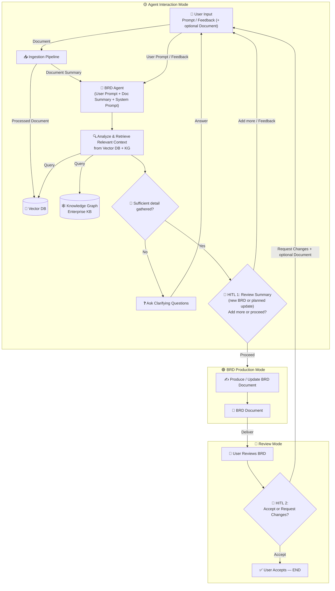
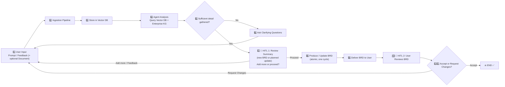

# BRD Agent Flow Diagram (Final — 3-State + HITL Gates)

## State-Based Flow Diagram

---

## Linear Step-by-Step (with HITL Gates)

---

## State Machine Table

| State | Purpose | Entry From | Exit To | HITL Gate |
|-------|---------|------------|---------|-----------|
| 🟡 **Agent Interaction** | Ingest & summarize document, analyze, retrieve from Vector DB + enterprise KG, ask clarifying questions, and collect review feedback. Agent decides when enough detail is gathered. | User input / Review changes | 🟢 BRD Production | **HITL 1** — user reviews the summary, then adds more or approves production |
| 🟢 **BRD Production** | Generate initial BRD **or** update existing BRD atomically, all at once, with the complete gathered context. Multiple cycles allowed. | 🟡 Agent Interaction (HITL 1 approved) | 🔵 Review Mode | Auto-transition on completion |
| 🔵 **Review Mode** | User reviews delivered BRD and decides to accept or request changes. | 🟢 BRD Production | ✅ END (accept) / 🟡 Agent Interaction (request changes) | **HITL 2** — user accepts or requests changes |

---

## The Two HITL Gates

| Gate | Location | Prompt | Outcome A | Outcome B |
|------|----------|--------|-----------|-----------|
| **HITL 1** | 🟡 Agent Interaction → 🟢 Production | *New BRD:* "Here's a summary of what I've gathered — add anything, or proceed?" · *Update:* "Based on your feedback, here's the update I'll make to the current doc — proceed, or add more feedback?" | `Proceed` → 🟢 BRD Production | `Add more / feedback` → stay in 🟡 Agent Interaction |
| **HITL 2** | Inside 🔵 Review Mode | *"Please review the BRD. Accept, or request changes?"* | `Accept` → ✅ END | `Request changes (+ optional document)` → 🟡 Agent Interaction |

---

## Key Design Rules

1. **🟡 Agent Interaction is the universal entry point** — initial prompts, clarifications, and review changes all enter here.
2. **🟢 Production is atomic** — BRD is produced/updated **once** per cycle with the complete gathered context. Multiple cycles are allowed (initial generation, then updates after feedback).
3. **Feedback re-entry is not a separate mode** — it is the same Agent Interaction loop, entered with the current draft in context. The user may attach supporting documents with feedback (ingested through the same pipeline), and the loop ends at the same HITL 1 gate.
4. **HITL 1 is the single per-cycle approval** — for both generation and updates. The agent cannot auto-jump to 🟢 Production; it must pause and present a summary (gathered requirements for a new BRD, or the concrete planned change to the current document for an update) and get explicit approval. The user either proceeds or adds more feedback. This prevents premature drafting.
5. **🟢 → 🔵 is auto** — Once production starts, it completes and auto-delivers to Review Mode. No user action needed mid-production.
6. **Only 🔵 → 🟡 requires user action** — Requesting changes from Review Mode (HITL 2) is the only backward transition triggered by the user.
7. **The Knowledge Graph is a pre-seeded enterprise KB** — Ingestion populates the Vector DB only; the agent reads enterprise context (stakeholders, business units, regulatory domains, systems) from the KG but does not write to it. Enriching the KG from ingested documents is a future option, not part of the current flow.