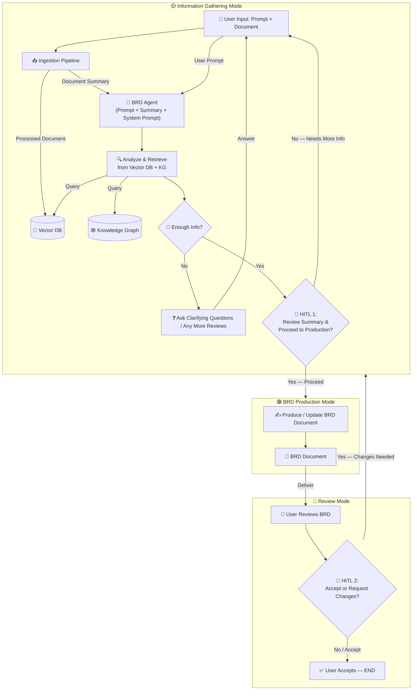
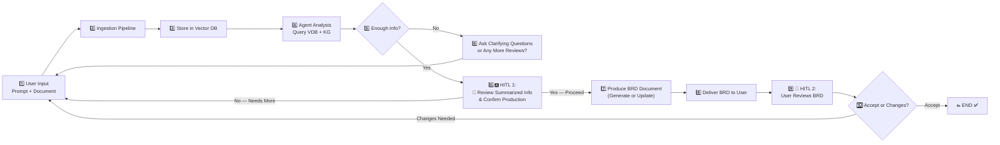

# BRD Agent Flow Diagram (Final — 3-State + HITL Gates)

## State-Based Flow Diagram

---

## Linear Step-by-Step (with HITL Gates)

---

## State Machine Table

| State | Purpose | Entry From | Exit To | HITL Gate |
|-------|---------|------------|---------|-----------|
| 🟡 **Information Gathering** | Ingest, summarize, analyze, retrieve from VDB+KG, ask clarifying questions, collect **all** review feedback. Agent decides when enough info is gathered. | User input / Review changes | 🟢 BRD Production | **HITL 1** — User must review summary & confirm before production |
| 🟢 **BRD Production** | Generate initial BRD **or** update existing BRD atomically with all gathered context | 🟡 Gathering (HITL 1 = Yes) | 🔵 Review Mode | Auto-transition on completion |
| 🔵 **Review Mode** | User reviews delivered BRD. Decides to accept or request changes. | 🟢 BRD Production | ✅ END (HITL 2 = Accept) / 🟡 Gathering (HITL 2 = Changes) | **HITL 2** — User decides accept or changes |

---

## The Two HITL Gates

| Gate | Location | Question | Yes → | No → |
|------|----------|----------|-------|------|
| **HITL 1** | Between 🟡 Gathering and 🟢 Production | *"I've gathered enough info. Here's a summary. Shall I proceed to generate/update the BRD?"* | 🟢 BRD Production | 🟡 Information Gathering (agent asks more questions) |
| **HITL 2** | Inside 🔵 Review Mode | *"Please review the BRD. Accept or request changes?"* | ✅ END | 🟡 Information Gathering (batch feedback collection) |

---

## Key Design Rules

1. **🟡 Gathering is the universal entry point** — initial prompts, clarifications, and review changes all enter here.
2. **🟢 Production is atomic** — BRD is produced/updated **once** per cycle with the complete gathered context.
3. **Batch reviews** — If user wants changes at HITL 2, agent asks *"Any more reviews?"* and keeps looping inside 🟡 Gathering until user says no. Then it exits to 🟢 Production and applies everything at once.
4. **HITL 1 is mandatory** — The agent cannot auto-jump to 🟢 Production. It must pause, present a summary of gathered requirements, and get explicit user approval. This prevents premature drafting.
5. **🟢 → 🔵 is auto** — Once production starts, it completes and auto-delivers to Review Mode. No user action needed mid-production.
6. **Only 🔵 → 🟡 requires user action** — Requesting changes from Review Mode is the only backward transition triggered by the user.
