# Context Assembly Flow Diagram v2.0 (Chassis-Aligned)

This diagram decomposes how `ContextAssembler.assemble()` builds the LLM prompt for each turn, updated for **semantic routing**, **validation error injection** (retry loop), **Presidio guardrails**, and **atomic production**.

```mermaid
flowchart TB
    subgraph INPUT["🎯 Assembler Inputs"]
        I1["mode: ChatMode"]
        I2["messages: list[BaseMessage]"]
        I3["brd_memory: dict (checkpointed)"]
        I4["rolling_summary: dict"]
        I5["current_draft: dict"]
        I6["ContextStrategy (semantic router)"]
        I7["pending_feedback: list[str]"]
        I8["feedback_gathering: bool"]
        I9["validation_errors: list[str]<br/>(v2: retry loop injection)"]
    end

    subgraph LAYERS["📚 Prompt Stack Layers"]
        direction TB
        L0["L0: System Prompt<br/>(gathering | drafting | request_changes | update variant)"]
        L1["L1: BRDMemory Block<br/>(filtered by strategy or FULL)"]
        L2["L2: Rolling Summary Block<br/>(ConversationSummary prose)"]
        L3["L3: Doc Retrieval Block<br/>Chroma hits (top-k)"]
        L4["L4: KG Retrieval Block<br/>Neo4j entities + 1-hop neighbours"]
        L5["L5: Artifact Summary Block<br/>Template refs, tool outputs"]
        L6["L6: Draft + Feedback Block<br/>(current_draft + ALL pending_feedback)<br/>[REFINEMENT / BRD_UPDATE only]"]
        L7["L7: Validation Errors Block<br/>(v2: injected on retry)<br/>[DRAFTING retry only]"]
        L8["L8: Conversation Slice<br/>recent N turns (strategy-dependent)"]
    end

    subgraph OUTPUT["📤 Assembler Output"]
        O1["AssembledContext object"]
        O2["messages: list[SystemMessage, ...HumanMessage, AIMessage]"]
        O3["token_counts: dict per section"]
        O4["strategy_used: ContextStrategy"]
    end

    subgraph STATE["💾 State Write"]
        W1["last_retrievals['assembled'] = AssembledContext"]
    end

    I1 --> L0
    I6 --> |"selects prompt variant"| L0
    I3 --> |"filtered by strategy.fields"| L1
    I4 --> L2
    I6 --> |"top_k_docs"| L3
    I6 --> |"top_k_kg"| L4
    I6 --> |"include_artifacts"| L5
    I5 --> |"if REFINEMENT / BRD_UPDATE"| L6
    I7 --> |"if REFINEMENT / BRD_UPDATE"| L6
    I9 --> |"if retry_count > 0"| L7
    I2 --> |"slice recent N turns"| L8

    L0 --> O1
    L1 --> O1
    L2 --> O1
    L3 --> O1
    L4 --> O1
    L5 --> O1
    L6 --> O1
    L7 --> O1
    L8 --> O1
    O1 --> O2
    O1 --> O3
    O1 --> O4
    O1 --> W1

    %% Strategy-specific modifiers
    subgraph STRATEGIES["🔀 Strategy Modifiers"]
        S1["INFORMATION_GATHERING<br/>→ 6 turns, summary ON,<br/>memory FULL, no draft, no feedback,<br/>2 doc, 2 KG"]
        S2["CLARIFICATION<br/>→ 10 turns, summary ON,<br/>memory FULL, no draft, no feedback,<br/>2 doc, 2 KG"]
        S3["REFINEMENT<br/>→ 10 turns, summary ON,<br/>memory FULL, draft INJECTED,<br/>ALL pending_feedback INJECTED,<br/>2 doc, 2 KG"]
        S4["BRD_GENERATION<br/>→ ALL turns, summary ON,<br/>memory FULL, no draft, no feedback,<br/>4 doc, 4 KG"]
        S5["BRD_UPDATE<br/>→ ALL turns, summary ON,<br/>memory FULL, current_draft INJECTED,<br/>ALL pending_feedback INJECTED,<br/>4 doc, 4 KG"]
        S6["TEMPLATE_GUIDED<br/>→ 6 turns, template artifact INJECTED"]
        S7["COMPLIANCE_HEAVY<br/>→ 6 turns, regulatory KG boost"]
    end

    I6 --> S1
    I6 --> S2
    I6 --> S3
    I6 --> S4
    I6 --> S5
    I6 --> S6
    I6 --> S7

    S1 -.->|"modifies"| L7
    S2 -.->|"modifies"| L7
    S3 -.-> |"injects"| L6
    S3 -.-> |"modifies"| L8
    S4 -.-> |"modifies"| L8
    S4 -.-> |"boosts"| L3
    S4 -.-> |"boosts"| L4
    S5 -.-> |"injects"| L6
    S5 -.-> |"modifies"| L8
    S5 -.-> |"boosts"| L3
    S5 -.-> |"boosts"| L4
    S6 -.-> |"injects"| L5
    S7 -.-> |"boosts"| L4
```



## Layer Build Order

The `ContextAssembler` always constructs the prompt in this **fixed order**:

1. **System Message** (`L0`) — Role definition, tone, constraints. Variant chosen by `mode` + strategy.
   - `GATHERING_SYSTEM_PROMPT` for initial/clarification.
   - `REQUEST_CHANGES_SYSTEM_PROMPT` for refinement (feedback gathering).
   - `DRAFTING_SYSTEM_PROMPT` for initial BRD generation.
   - `UPDATE_SYSTEM_PROMPT` for atomic BRD update.
2. **Memory Block** (`L1`) — Structured dump of `BRDMemory` fields.
3. **Rolling Summary** (`L2`) — Compressed narrative of older turns.
4. **Document Retrieval** (`L3`) — Chroma hits.
5. **Knowledge Graph** (`L4`) — Neo4j hits.
6. **Artifact Summaries** (`L5`) — `ArtifactRef` items.
7. **Draft + Feedback** (`L6`) — Only in `REFINEMENT` and `BRD_UPDATE`. Shows:
   - Current draft JSON (as baseline)
   - **ALL** items from `pending_feedback` numbered 1..N
   - Instruction: "Apply all feedback items atomically. Preserve unchanged sections."
8. **Validation Errors** (`L7`) — **v2:** Only injected during drafting retries (`retry_count > 0`). Shows the Pydantic validation error details so the LLM can self-correct (Chassis §3.5: pre-HITL self-check).
9. **Conversation Slice** (`L8`) — Recent `HumanMessage` / `AIMessage` objects.

## Token Accounting

For each layer, the assembler tracks token count:

```python
{
    "system": 180,
    "memory": 420,
    "summary": 180,
    "docs": 340,
    "kg": 210,
    "artifacts": 80,
    "draft_feedback": 0,    # 0 unless REFINEMENT/BRD_UPDATE
    "conversation": 560,
    "total": 1970
}
```

When `REFINEMENT` or `BRD_UPDATE` is active, `draft_feedback` includes:
- The full current draft JSON (may be 500–1500 tokens)
- All pending feedback items (may be 100–500 tokens)
- This can significantly increase total prompt size.

When retrying (drafting graph validation loop), `validation_errors` adds:
- Pydantic error details (typically 50–200 tokens)
- Self-correction instruction (typically 50 tokens)

## Strategy Decision Logic (v2 — Semantic Router)

```
# Priority 1: Explicit mode/flag overrides
if feedback_gathering == true:
    if current_draft exists:
        return BRD_UPDATE
    else:
        return REFINEMENT
elif mode == "drafting":
    if current_draft exists:
        return BRD_UPDATE
    else:
        return BRD_GENERATION
elif mode == "request_changes":
    return REFINEMENT

# Priority 2: Semantic router (v2 — replaces keyword matching)
route = semantic_router.classify(user_message)
#   Uses embedding-based intent classification with
#   example utterances per route. FastEmbed encoder
#   (local, no API key). Routes: TEMPLATE_GUIDED,
#   COMPLIANCE_HEAVY, CLARIFICATION
if route is not None:
    return route

# Priority 3: Default fallback
return INFORMATION_GATHERING
```

**v2 improvement:** The `semantic-router` library uses embedding similarity against curated example utterances per route. This means "We need to follow privacy rules" now correctly routes to `COMPLIANCE_HEAVY` (same as "I want to be compliant with GDPR"), even though the keywords differ. The router is local-only (FastEmbed encoder, no API key required).

**Presidio note:** The assembled context passes through Presidio input guardrails before being sent to the LLM. Financial/contact PII is masked; person names and IPs are logged but not masked.
