# Detailed Flow Diagram — BRD Agent v2.0 (Chassis-Aligned)

This diagram shows the complete data flow from user input through all system components, including state mutations at each step, with **conditional edges**, **HITL interrupts**, **Presidio guardrails**, **validation retry loop**, and **draft versioning**.

```mermaid
flowchart TB
    subgraph USER["👤 User / Frontend (Streamlit)"]
        U1["Send initial prompt + document (/chat)"]
        U2["Answer clarifying question (/chat)"]
        U3["Confirm HITL 1: Proceed (/generate-brd)"]
        U4["Enter review feedback (/request-changes)"]
        U5["Say 'no more reviews' (/chat)"]
        U6["Click Approve (/approve)"]
        U7["Upload document (/upload)"]
    end

    subgraph API["🌐 FastAPI Endpoints"]
        E1["/chat"]
        E2["/generate-brd"]
        E3["/request-changes"]
        E4["/approve"]
        E5["/upload"]
        E6["/drafts"]
    end

    subgraph GUARD_IN["🛡️ Presidio Input Guardrail"]
        GI["Scan for PII<br/>Mask: SSN, CC, bank, email, phone<br/>Log-only: PERSON, IP"]
    end

    subgraph STATE["📦 ChatbotState (LangGraph per-thread, SqliteSaver)"]
        S1["messages: list[BaseMessage]"]
        S2["mode: ChatMode"]
        S3["brd_memory: dict"]
        S4["current_draft: dict"]
        S5["reply_text: str"]
        S6["rolling_summary: dict"]
        S7["last_retrievals: dict"]
        S8["pending_feedback: list[str]"]
        S9["feedback_gathering: bool"]
        S10["ready_for_production: bool"]
        S11["draft_status: DraftStatus"]
        S12["rejection_count: int"]
        S13["draft_history: list[dict]"]
        S14["retry_count: int"]
        S15["validation_errors: list[str]"]
    end

    subgraph GATHER["🔵 Agent Interaction Graph (Conditional Edges)"]
        G1["summarize"]
        G2["retrieve_context"]
        G3["invoke_llm"]
        G_ROUTE{"route_after_conversation"}
        G4["extract_memory"]
        G5["hitl_gate<br/>(interrupt)"]
    end

    subgraph GUARD_OUT["🛡️ Presidio Output Guardrail"]
        GO["Scan LLM output for PII leakage"]
    end

    subgraph DRAFT["🟢 Drafting Graph (Validation Retry Loop)"]
        D1["retrieve_context"]
        D2["draft_llm"]
        D3["schema_validate"]
        D_ROUTE{"route_after_validation"}
        D4["error_handler"]
    end

    subgraph SOURCES["🗃️ Data Sources"]
        CH["Chroma Vector Store<br/>(templates, glossary, prior BRDs, docs)"]
        NEO["Neo4j KG / Enterprise KB<br/>(stakeholders, systems, domains)"]
        ART["Artifact Store<br/>(template refs, large outputs)"]
    end

    subgraph MEM["🧠 LangMem (InMemoryStore + SqliteSaver safety net)"]
        M1["Namespace: brd_agent/&lt;session_id&gt;"]
        M2["BRDMemory items"]
        M3["ConversationSummary items"]
    end

    subgraph LLM["🤖 LLM Client"]
        L1["Azure OpenAI / Ollama"]
    end

    subgraph TEL["📊 Telemetry"]
        T1["OpenTelemetry + Phoenix"]
    end

    %% === UNIVERSAL GATHERING ENTRY ===
    U1 --> E1
    U2 --> E1
    U5 --> E1

    E1 --> GI
    GI --> |"cleaned message"| S1
    E1 --> |"mode = gathering"| S2

    S1 --> G1

    %% summarize node
    G1 --> |"if len(messages) > 12"| G1A["Call LLM → ConversationSummary"]
    G1A --> |"merge"| S6
    G1A --> |"emit RemoveMessage"| S1
    G1 --> G2

    %% retrieve_context node
    G2 --> |"read"| S2
    G2 --> |"read"| S3
    G2 --> |"read"| S6
    G2 --> |"read"| S4
    G2 --> |"read"| S1
    G2 --> |"read"| S8
    G2 --> |"read"| S9
    G2 --> |"infer ContextStrategy<br/>(semantic router)"| STRAT["Strategy:<br/>INFORMATION_GATHERING / CLARIFICATION / REFINEMENT"]
    G2 --> |"query"| CH
    G2 --> |"query"| NEO
    G2 --> |"read refs"| ART
    CH --> |"doc hits"| G2
    NEO --> |"entity hits"| G2
    ART --> |"summaries"| G2
    G2 --> |"write assembled"| S7
    G2 --> G3

    %% invoke_llm node
    G3 --> |"read assembled"| S7
    G3 --> |"call"| L1
    L1 --> |"AIMessage"| GO
    GO --> |"cleaned reply"| G3
    G3 --> |"append"| S1
    G3 --> |"write"| S5
    G3 --> |"set"| S10

    %% === CONDITIONAL EDGE (v2) ===
    G3 --> G_ROUTE
    G_ROUTE --> |"ready_for_production == true"| G5
    G_ROUTE --> |"continue gathering"| G4

    %% hitl_gate (HITL 1 — interrupt)
    G5 --> |"interrupt()"| HITL1["👤 HITL 1:<br/>Review Summary &<br/>Proceed / Add More"]
    HITL1 --> |"User confirms"| E2
    HITL1 --> |"Add more"| E1R["Return to gathering"]

    %% extract_memory node
    G4 --> |"last 2 msgs"| S1
    G4 --> |"LangMem extract"| M1
    M1 --> |"merge"| M2
    M2 --> |"read back merged"| G4
    G4 --> |"write"| S3
    G4 --> |"END"| E1RN["Return {reply, mode, session_id}"]
    E1RN --> USER
    E1R --> USER

    %% === ATOMIC PRODUCTION ===
    U3 --> E2
    E2 --> |"mode = drafting, retry_count = 0"| S2
    S2 --> D1
    D1 --> |"read"| S1
    D1 --> |"read"| S3
    D1 --> |"read"| S6
    D1 --> |"read"| S8
    D1 --> |"read"| S15
    D1 --> |"strategy = BRD_GENERATION or BRD_UPDATE"| D1A["Full memory + all turns + pending_feedback + 4 doc + 4 KG"]
    D1A --> |"query"| CH
    D1A --> |"query"| NEO
    CH --> D1
    NEO --> D1
    D1 --> |"write assembled"| S7
    D1 --> D2
    D2 --> |"Presidio input scan"| GI2["🛡️ Scan context"]
    GI2 --> |"read assembled"| S7
    D2 --> |"call JSON mode (temp=0.2, max_tokens=4000)"| L1
    L1 --> |"raw JSON"| D2
    D2 --> |"write draft_raw"| S7
    D2 --> D3
    D3 --> |"read draft_raw"| S7
    D3 --> |"extract JSON, inject drafted_by, validate Pydantic"| D3A{"Valid?"}

    %% === VALIDATION RETRY LOOP (v2) ===
    D3A --> D_ROUTE
    D_ROUTE --> |"valid"| D3B["Write current_draft + append draft_history"]
    D_ROUTE --> |"invalid, retry_count < 2"| D2
    D_ROUTE --> |"invalid, max retries"| D4
    D3B --> |"Presidio output scan"| GO2["🛡️ Scan BRD"]
    GO2 --> S4
    D3B --> |"draft_status = DRAFT"| S11
    D3B --> |"append"| S13
    D3B --> |"clear"| S8_CLR["pending_feedback = []"]
    D3B --> |"interrupt_after"| REV["🔵 Review Mode (HITL 2)"]
    D4 --> |"graceful error"| E2ERR["Return {error, validation_errors}"]
    REV --> |"END"| E2R["Return {draft, mode: awaiting_approval, version}"]
    E2R --> USER
    E2ERR --> USER

    %% === REVIEW RE-ENTRY (HITL 2 = Changes) ===
    U4 --> E3
    E3 --> |"append feedback to"| S8
    E3 --> |"feedback_gathering = true"| S9
    E3 --> |"draft_status = REJECTED"| S11
    E3 --> |"rejection_count += 1"| S12
    E3 --> |"mode = request_changes"| S2
    S1 --> G1

    %% === APPROVE (HITL 2 = Accept) ===
    U6 --> E4
    E4 --> |"draft_status = APPROVED"| S11
    E4 --> |"update draft_history"| S13
    E4 --> |"Return {status: approved, brd_id, version}"| USER
    S11 --> |"END"| END_L["✅ END"]

    %% === UPLOAD ===
    U7 --> E5
    E5 --> |"background task"| ING["📥 Ingestion Pipeline"]
    ING --> |"chunks"| CH

    %% === DRAFTS ===
    E6 --> |"read"| S13

    %% Telemetry spans everything
    E1 -.-> |"span"| T1
    E2 -.-> |"span"| T1
    E3 -.-> |"span"| T1
    G1 -.-> |"span"| T1
    G2 -.-> |"span"| T1
    G3 -.-> |"span"| T1
    G4 -.-> |"span"| T1
    G5 -.-> |"span"| T1
    D1 -.-> |"span"| T1
    D2 -.-> |"span"| T1
    D3 -.-> |"span"| T1
    L1 -.-> |"auto-instrument child spans"| T1
```

## Legend

- **Solid arrows (→):** Data flow / state mutation.
- **Dashed arrows (-.-→):** Telemetry / side-effect spans.
- **Blue nodes:** Agent Interaction graph execution (conditional routing).
- **Green nodes:** Drafting graph execution (validation retry loop).
- **Shield nodes (🛡️):** Presidio guardrail checkpoints.
- **Diamond nodes:** Conditional routing decisions (pure functions, no side effects).
- **Orange nodes:** HITL gates — LangGraph `interrupt()` calls.
- **State reads** are shown explicitly so you can trace which node needs which field.

## v2 Key Changes

| Change | v1 (Baseline) | v2 (Chassis-Aligned) |
|:---|:---|:---|
| **Graph routing** | Linear chains only | Conditional edges: `route_after_conversation`, `route_after_validation` |
| **HITL 1** | Ad-hoc readiness flag | LangGraph `interrupt()` in `hitl_gate` node |
| **HITL 2** | Session flag | `interrupt_after=[\"schema_validate\"]` + `draft_status` in state |
| **Validation failure** | Exception → graph halts → 500 | Retry loop: error fed back to LLM (max 2 retries) → `error_handler` |
| **PII protection** | None | Presidio guardrails on every LLM input/output |
| **Session management** | Global singleton | Request-scoped `session_id` → SqliteSaver checkpointer |
| **Draft versioning** | `current_draft` overwritten | Append-only `draft_history` with full provenance |
| **Approval** | `session.approved` flag | `draft_status` enum in `ChatbotState` |
| **Rejection tracking** | Not tracked | `rejection_count` incremented, logged for observability |
| **Strategy inference** | Keyword matching | Semantic router (embedding-based) |
| **New endpoints** | — | `/upload`, `/drafts`, `/drafts/{version}` |
