# Detailed Flow Diagram — BRD Agent (3-State + HITL Gates)

This diagram shows the complete data flow from user input through all system components, including state mutations at each step, with the **3-state simplified design** (universal gathering, atomic production per cycle, feedback gathering) and the **2 HITL gates**.

```mermaid
flowchart TB
    subgraph USER["👤 User / Frontend"]
        U1["Send initial prompt + document (/chat)"]
        U2["Answer clarifying question (/chat)"]
        U3["Confirm HITL 1: Proceed to Production (/generate-brd)"]
        U4["Enter review feedback (/request-changes)"]
        U5["Say 'no more reviews' (/chat)"]
        U6["Click Approve (/approve)"]
    end

    subgraph API["🌐 FastAPI Endpoints"]
        E1["/chat"]
        E2["/generate-brd"]
        E3["/request-changes"]
        E4["/approve"]
    end

    subgraph STATE["📦 ChatbotState (LangGraph per-thread)"]
        S1["messages: list[BaseMessage]"]
        S2["mode: ChatMode"]
        S3["brd_memory: dict"]
        S4["current_draft: dict"]
        S5["reply_text: str"]
        S6["rolling_summary: dict"]
        S7["last_retrievals: dict"]
        S8["pending_feedback: list[str]"]
        S9["feedback_gathering: bool"]
    end

    subgraph GATHER["🔵 Gathering Graph (Universal Entry)"]
        G1["summarize"]
        G2["retrieve_context"]
        G3["invoke_llm"]
        G4["extract_memory"]
    end

    subgraph DRAFT["🟢 Drafting Graph (Atomic Production)"]
        D1["retrieve_context"]
        D2["draft_llm"]
        D3["schema_validate"]
    end

    subgraph SOURCES["🗃️ Data Sources"]
        CH["Chroma Vector Store<br/>(templates, glossary, prior BRDs, docs)"]
        NEO["Neo4j KG<br/>(stakeholders, systems, domains)"]
        ART["Artifact Store<br/>(template refs, large outputs)"]
    end

    subgraph MEM["🧠 LangMem Store"]
        M1["Namespace: brd_agent/&lt;session_id&gt;"]
        M2["BRDMemory items"]
        M3["ConversationSummary items"]
    end

    subgraph LLM["🤖 LLM Client"]
        L1["Azure OpenAI / Ollama"]
    end

    subgraph TEL["📊 Telemetry"]
        T1["OpenTelemetry + Phoenix"]
    end

    %% === UNIVERSAL GATHERING ENTRY ===
    U1 --> E1
    U2 --> E1
    U5 --> E1

    E1 --> |"append HumanMessage"| S1
    E1 --> |"mode = gathering"| S2

    S1 --> G1

    %% summarize node
    G1 --> |"if len(messages) > 12"| G1A["Call LLM → ConversationSummary"]
    G1A --> |"merge"| S6
    G1A --> |"emit RemoveMessage"| S1
    G1 --> G2

    %% retrieve_context node
    G2 --> |"read"| S2
    G2 --> |"read"| S3
    G2 --> |"read"| S6
    G2 --> |"read"| S4
    G2 --> |"read"| S1
    G2 --> |"read"| S8
    G2 --> |"read"| S9
    G2 --> |"infer ContextStrategy"| STRAT["Strategy:<br/>INFORMATION_GATHERING / CLARIFICATION / REFINEMENT"]
    G2 --> |"query"| CH
    G2 --> |"query"| NEO
    G2 --> |"read refs"| ART
    CH --> |"doc hits"| G2
    NEO --> |"entity hits"| G2
    ART --> |"summaries"| G2
    G2 --> |"write assembled"| S7
    G2 --> G3

    %% invoke_llm node
    G3 --> |"read assembled"| S7
    G3 --> |"call"| L1
    L1 --> |"AIMessage"| G3
    G3 --> |"append"| S1
    G3 --> |"write"| S5

    %% Feedback gathering + HITL1 decision inside invoke_llm
    G3 --> |"if enough_info OR feedback complete"| DEC_BATCH{"Enough Info / Feedback Complete?"}
    DEC_BATCH --> |"YES"| HITL1["👤 HITL 1:<br/>Review Summary &<br/>Proceed to Production?"]
    HITL1 --> |"User confirms"| E2
    HITL1 --> |"User says No — need more"| E1R["Return {reply, summary, ready_for_production: false}"]
    DEC_BATCH --> |"NO / continue gathering"| G4
    G3 --> |"normal flow"| G4

    %% extract_memory node
    G4 --> |"last 2 msgs"| S1
    G4 --> |"LangMem extract"| M1
    M1 --> |"merge"| M2
    M2 --> |"read back merged"| G4
    G4 --> |"write"| S3
    G4 --> |"END"| E1RN["Return {reply, mode, draft?, turn_id}"]
    E1RN --> USER
    E1R --> USER

    %% === ATOMIC PRODUCTION ===
    U3 --> E2
    E2 --> |"mode = drafting"| S2
    S2 --> D1
    D1 --> |"read"| S1
    D1 --> |"read"| S3
    D1 --> |"read"| S6
    D1 --> |"read"| S8
    D1 --> |"strategy = BRD_GENERATION or BRD_UPDATE"| D1A["Full memory + all turns + pending_feedback + 4 doc + 4 KG"]
    D1A --> |"query"| CH
    D1A --> |"query"| NEO
    CH --> D1
    NEO --> D1
    D1 --> |"write assembled"| S7
    D1 --> D2
    D2 --> |"read assembled"| S7
    D2 --> |"call JSON mode (temp=0.2, max_tokens=4000)"| L1
    L1 --> |"raw JSON"| D2
    D2 --> |"write draft_raw"| S7
    D2 --> D3
    D3 --> |"read draft_raw"| S7
    D3 --> |"extract JSON, inject drafted_by, validate Pydantic"| D3A{"Valid?"}
    D3A --> |"YES"| D3B["write current_draft"]
    D3B --> S4
    D3B --> |"clear"| S8_CLR["pending_feedback = []"]
    D3A --> |"NO"| D3C["Raise ERROR → graph halts"]
    D3B --> |"Auto-transition"| REV["🔵 Review Mode (HITL 2)"]
    REV --> |"END"| E2R["Return {draft, mode: awaiting_approval}"]
    E2R --> USER

    %% === BATCH REVIEW RE-ENTRY (HITL 2 = Changes) ===
    U4 --> E3
    E3 --> |"append feedback to"| S8
    E3 --> |"feedback_gathering = true"| S9
    E3 --> |"mode = request_changes"| S2
    S1 --> G1

    %% === APPROVE (HITL 2 = Accept) ===
    U6 --> E4
    E4 --> |"session.approved = True"| SESS["SessionState"]
    E4 --> |"Return {status: approved, brd_id}"| USER
    SESS --> |"END"| END_L["✅ END"]

    %% Telemetry spans everything
    E1 -.->|"span"| T1
    E2 -.->|"span"| T1
    E3 -.->|"span"| T1
    G1 -.->|"span"| T1
    G2 -.->|"span"| T1
    G3 -.->|"span"| T1
    G4 -.->|"span"| T1
    D1 -.->|"span"| T1
    D2 -.->|"span"| T1
    D3 -.->|"span"| T1
    L1 -.->|"auto-instrument child spans"| T1
```

## Legend

- **Solid arrows (→):** Data flow / state mutation.
- **Dashed arrows (-.->):** Telemetry / side-effect spans.
- **Blue nodes:** Gathering graph execution (universal entry).
- **Green nodes:** Drafting graph execution (atomic production).
- **Yellow decisions:** HITL 1 gate and feedback collection points.
- **Orange node:** HITL 1 checkpoint — user must review summary and confirm before production.
- **State reads** are shown explicitly so you can trace which node needs which field.

## Key Flow Changes (vs. previous version)

1. **All user input routes through `/chat` or `/request-changes` → Gathering Graph.** No direct production entry except via **HITL 1 confirmation**.
2. **HITL 1 gate replaces auto-transition** — After "Enough Info? = Yes" or feedback collection complete, the agent presents a summary and asks the user to confirm before calling `/generate-brd`. Prevents premature drafting.
3. **`pending_feedback` accumulates in state** during feedback gathering. Only cleared after successful schema validation.
4. **`feedback_gathering` flag** controls the "Any more reviews?" loop. When cleared, the system reaches HITL 1 (not auto-production).
5. **Drafting Graph reads `pending_feedback`** and includes it in the assembled context for atomic updates.
6. **Review Mode is HITL 2** — User must actively decide accept or changes. Auto-transition from Production still happens, but exit from Review requires user action.
