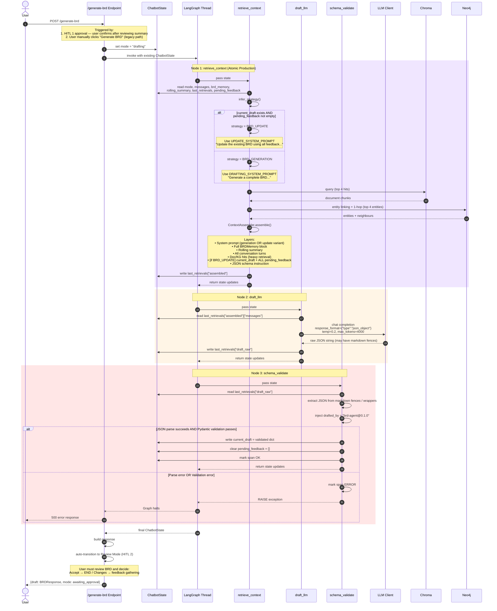

# Drafting Graph Sequence Diagram (Atomic Production)

This diagram shows the exact step-by-step execution inside the **Drafting Graph**, which now produces or updates the BRD **atomically** with complete gathered context.



## Node Execution Summary

| Step | Node | Reads From State | Writes To State | External I/O |
|---|---|---|---|---|
| 1 | `retrieve_context` | `mode`, `messages`, `brd_memory`, `rolling_summary`, `last_retrievals`, `pending_feedback` | `last_retrievals["assembled"]` | Chroma (4 hits), Neo4j (4 entities) |
| 2 | `draft_llm` | `last_retrievals["assembled"]` | `last_retrievals["draft_raw"]` | LLM (JSON mode, 4k tokens) |
| 3 | `schema_validate` | `last_retrievals["draft_raw"]` | `current_draft`, clears `pending_feedback` | Pydantic validation |

## Key Changes from Previous Version

### 1. Atomic Production
- **Before:** Drafting was only for initial generation. Revisions were ad-hoc through `/request-changes`.
- **Now:** Drafting handles both **initial generation** (`BRD_GENERATION`) and **atomic updates** (`BRD_UPDATE`). In both cases, the BRD is produced **once** with complete context.

### 2. Pending Feedback Inclusion
- **Before:** `pending_feedback` did not exist. Each `/request-changes` was a single feedback item that immediately triggered discussion.
- **Now:** `pending_feedback` is read by `retrieve_context` during `BRD_UPDATE` and injected into the prompt as a structured list. The LLM sees all accumulated changes at once.

### 3. Prompt Variants
| Variant | When Used | Key Instruction |
|---|---|---|
| `DRAFTING_SYSTEM_PROMPT` | `BRD_GENERATION` | "Generate a complete BRD from scratch matching this JSON schema..." |
| `UPDATE_SYSTEM_PROMPT` | `BRD_UPDATE` | "Update the existing BRD using the feedback items below. Preserve unchanged sections. Output full updated JSON..." |

### 4. Pending Feedback Cleared on Success
- **Before:** Not applicable (no feedback gathering).
- **Now:** `schema_validate` clears `pending_feedback = []` only after successful validation. If validation fails, the feedback remains in state so the retry (when implemented) can re-use it.

## Error Handling in Drafting Graph

```
┌─────────────────────────────────────────────────────────────┐
│  draft_llm → schema_validate                                │
│                                                             │
│  ┌─────────────┐    ┌─────────────────┐    ┌────────────┐  │
│  │  Raw JSON   │──>│  JSON.parse()   │──>│ Pydantic   │  │
│  │  (string)   │    │  (strip fences) │    │ validate   │  │
│  └─────────────┘    └─────────────────┘    └────────────┘  │
│                                                         │    │
│                                                    [FAIL]    │
│                                                         │    │
│                                                         ▼    │
│                                                  Exception   │
│                                                  Graph HALT  │
│                                                  500 to user │
│                                                  pending_feedback KEPT │
│                                                         │    │
│                                                    [PASS]    │
│                                                         ▼    │
│                                                  current_draft│
│                                                  pending_feedback CLEARED│
│                                                  awaiting_approval│
└─────────────────────────────────────────────────────────────┘
```

**Current gap:** No retry loop. If validation fails, the entire request fails. Because `pending_feedback` is **not cleared on failure**, a future retry mechanism can re-use the accumulated feedback.
