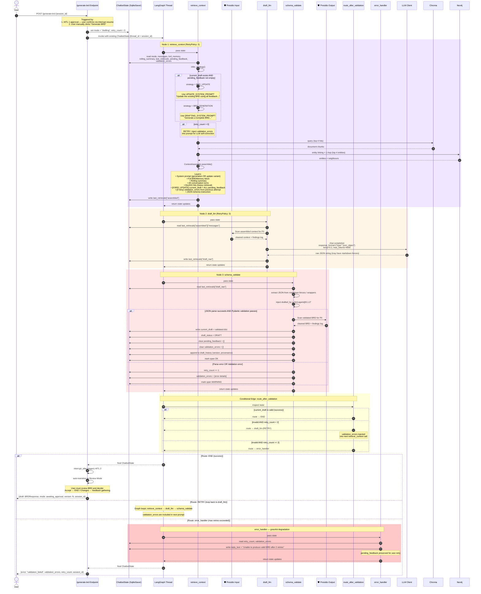

# Drafting Graph Sequence Diagram v2.0 (Validation Retry Loop)

This diagram shows the exact step-by-step execution inside the **Drafting Graph**, which now produces or updates the BRD **atomically** with a **validation retry loop** (max 2 retries), **Presidio guardrails**, and **draft versioning**.



## Node Execution Summary

| Step | Node | Reads From State | Writes To State | External I/O | Retry |
|---|---|---|---|---|---|
| 1 | `retrieve_context` | `mode`, `messages`, `brd_memory`, `rolling_summary`, `last_retrievals`, `pending_feedback`, `validation_errors` | `last_retrievals["assembled"]` | Chroma (4 hits), Neo4j (4 entities) | RetryPolicy(2) |
| 2 | `draft_llm` | `last_retrievals["assembled"]` | `last_retrievals["draft_raw"]` | Presidio (input) + LLM (JSON mode, 4k tokens) | RetryPolicy(3) |
| 3 | `schema_validate` | `last_retrievals["draft_raw"]` | `current_draft`, `draft_status`, `draft_history`, `retry_count`, `validation_errors`, clears `pending_feedback` | Pydantic validation + Presidio (output) | — |
| — | `route_after_validation` | `current_draft`, `retry_count` | — | — (pure routing) | — |
| 4 | `error_handler` | `retry_count`, `validation_errors` | `reply_text` | — | — |

## v2 Key Changes

### 1. Validation Retry Loop
- **v1:** Validation failure → exception → graph halts → 500 error to user.
- **v2:** Validation failure → `retry_count += 1` → `validation_errors` stored → `route_after_validation` routes back to `draft_llm` (max 2 retries). On each retry, the validation errors are injected into the prompt so the LLM can self-correct (Chassis §3.5: pre-HITL self-check).

### 2. Presidio Guardrails
- **Input:** Assembled context is scanned for PII before sending to LLM.
- **Output:** Validated BRD is scanned for PII leakage before returning to user.
- **Entity scope:** Mask SSN, credit cards, bank numbers, email, phone. Log-only: person names, IPs.

### 3. Draft Versioning
Each successful `schema_validate` appends an entry to `draft_history`:
```python
{
    "version": N,
    "draft": brd.model_dump(mode="json"),
    "produced_at": "2026-06-08T12:00:00Z",
    "prompt_hash": "sha256:abc123...",
    "context_strategy": "BRD_GENERATION",
    "model": "gpt-4o",
    "token_accounting": {...},
    "status": "draft",  # → approved / rejected
    "reviewed_by": None,
    "reviewed_at": None,
}
```

### 4. Pending Feedback Cleared on Success Only
- **v1:** Not applicable (no feedback gathering).
- **v2:** `schema_validate` clears `pending_feedback = []` only after successful validation. If validation fails, the feedback remains in state for the retry loop.

### 5. Error Handling (v2 Flow)

```
draft_llm → schema_validate
                    │
         route_after_validation
        ┌───────────┼───────────┐
        │           │           │
       END      draft_llm   error_handler
    (success)   (retry ≤2)   (max retries)
        │           │           │
    HITL 2      inject        return
  (interrupt)   errors     {error, details}
```
