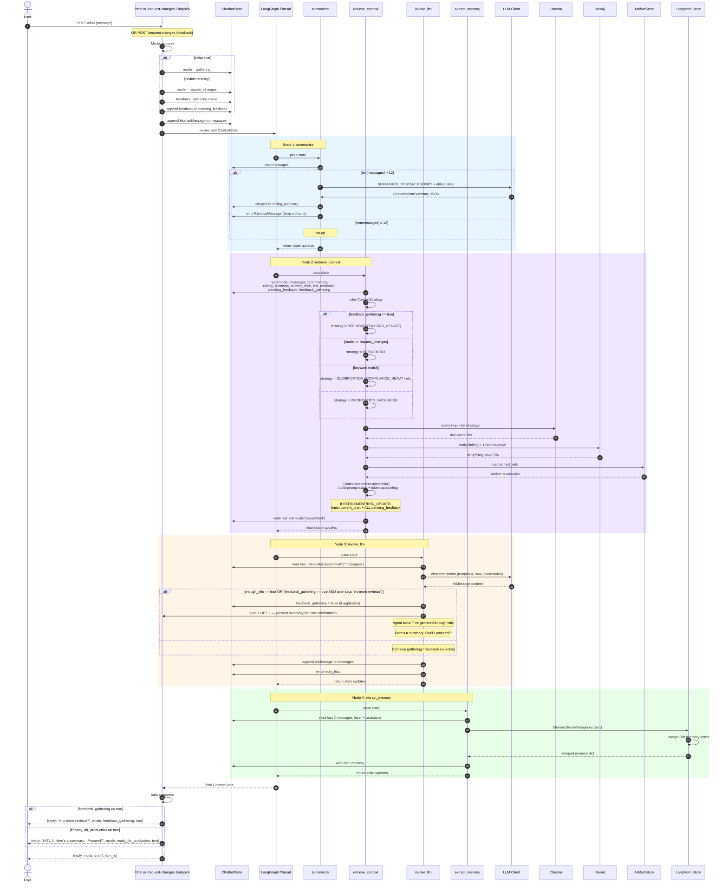

# Gathering Graph Sequence Diagram (Universal Entry + Feedback Gatherings)

This diagram shows the exact step-by-step execution inside the **Gathering Graph**, which is now the **universal entry point** for all user input — initial prompts, clarifications, and review feedback.



## Node Execution Summary

| Step | Node | Reads From State | Writes To State | External I/O |
|---|---|---|---|---|
| 1 | `summarize` | `messages` | `rolling_summary`, `messages` (RemoveMessage) | LLM (conditional) |
| 2 | `retrieve_context` | `mode`, `messages`, `brd_memory`, `rolling_summary`, `current_draft`, `last_retrievals`, `pending_feedback`, `feedback_gathering` | `last_retrievals["assembled"]` | Chroma, Neo4j, ArtifactStore |
| 3 | `invoke_llm` | `last_retrievals["assembled"]` | `messages`, `reply_text`, `feedback_gathering` (conditional) | LLM |
| 4 | `extract_memory` | `messages` (last 2) | `brd_memory` | LangMem Store |

## Key Differences from Previous Version

### 1. Universal Entry Point
- **Before:** `/chat` and `/request-changes` were separate paths with different semantics.
- **Now:** Both endpoints route through the **same Gathering Graph**. `/request-changes` simply sets `feedback_gathering = true` and appends feedback to `pending_feedback` before entering the graph.

### 2. Feedback Gathering Loop
- **Before:** Each `/request-changes` call immediately triggered a new draft generation after one turn of discussion.
- **Now:** The agent asks *"Any more reviews?"* and loops inside Gathering until the user explicitly signals completion. All feedback is accumulated in `pending_feedback` and applied atomically in the next Production cycle.

### 3. Strategy Inference Priority
```
if feedback_gathering == true:
    → REFINEMENT (or BRD_UPDATE if draft exists)
elif mode == "request_changes":
    → REFINEMENT
else:
    → keyword-based or default
```

### 4. Prompt Injection for Reviews
When `REFINEMENT` or `BRD_UPDATE` strategy is active, the assembler injects:
- The current draft JSON (so the LLM knows what it's updating)
- **ALL items in `pending_feedback`** (not just the latest one)
- A system instruction to ask "Any more reviews?" if `feedback_gathering` is still true.
