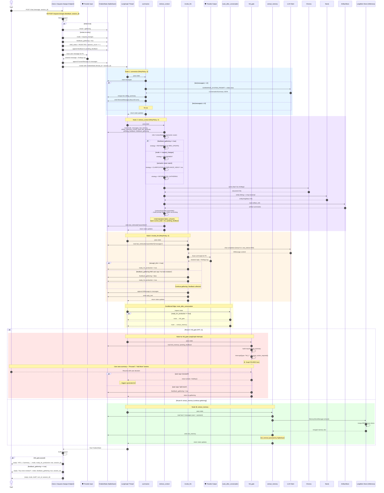

# Agent Interaction Graph Sequence Diagram v2.0 (Conditional Edges + HITL Interrupt)

This diagram shows the exact step-by-step execution inside the **Agent Interaction Graph**, which is the **universal entry point** for all user input. In v2, the graph uses **conditional edges** after `invoke_llm` and a dedicated **`hitl_gate` node** with LangGraph `interrupt()`.



## Node Execution Summary

| Step | Node | Reads From State | Writes To State | External I/O | Retry |
|---|---|---|---|---|---|
| 1 | `summarize` | `messages` | `rolling_summary`, `messages` (RemoveMessage) | LLM (conditional) | RetryPolicy(3) |
| 2 | `retrieve_context` | `mode`, `messages`, `brd_memory`, `rolling_summary`, `current_draft`, `last_retrievals`, `pending_feedback`, `feedback_gathering` | `last_retrievals["assembled"]` | Chroma, Neo4j, ArtifactStore | RetryPolicy(2) |
| 3 | `invoke_llm` | `last_retrievals["assembled"]` | `messages`, `reply_text`, `ready_for_production` | LLM + Presidio | RetryPolicy(3) |
| — | `route_after_conversation` | `ready_for_production` | — | — (pure routing) | — |
| 4a | `hitl_gate` | `brd_memory`, `pending_feedback` | `feedback_gathering`, `mode` | LangGraph `interrupt()` | — |
| 4b | `extract_memory` | `messages` (last 2) | `brd_memory` | LangMem Store | — |

## v2 Key Changes

### 1. Conditional Edge Replaces Linear Chain
- **v1:** `invoke_llm → extract_memory → END` (always linear).
- **v2:** `invoke_llm → route_after_conversation → hitl_gate | extract_memory`. The routing function is pure — inspects `ready_for_production` only, no side effects.

### 2. HITL 1 is a LangGraph Interrupt
- **v1:** Readiness was a flag returned to frontend; frontend decided when to call `/generate-brd`.
- **v2:** `hitl_gate` node calls `interrupt()`, which pauses the graph at the checkpointer level. The graph state is persisted to SqliteSaver. When the user responds, the graph resumes from the exact point.

### 3. Presidio Guardrails
- **v1:** No PII scanning.
- **v2:** Input guardrail scans user message before appending to state. Output guardrail scans LLM reply before returning to user.

### 4. Strategy Inference via Semantic Router
```
if feedback_gathering == true:
    → REFINEMENT (or BRD_UPDATE if draft exists)
elif mode == "request_changes":
    → REFINEMENT
else:
    → semantic_router(user_message)  # embedding-based, replaces keyword matching
    → fallback: INFORMATION_GATHERING
```

### 5. Rejection Tracking
When entering via `/request-changes`, the endpoint sets `draft_status = REJECTED` and increments `rejection_count` before invoking the graph. This is logged for observability (no hard cap in PoC).
