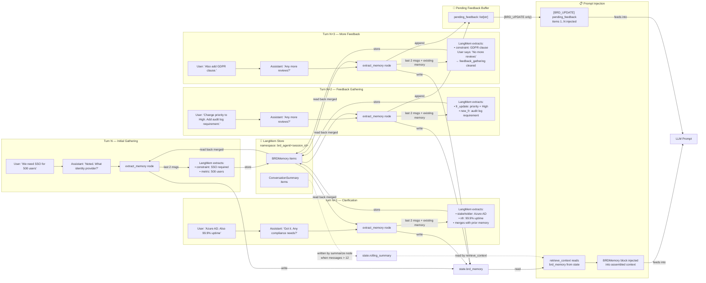

# Memory Lifecycle Diagram (Simplified 3-State)

This diagram shows how facts flow from conversation → LangMem extraction → merged memory → prompt context across multiple turns, now updated for **feedback gatherings** and **atomic production**.



## Dual Memory Tracks

The system maintains two parallel memory systems in the same LangMem namespace, discriminated by schema:

| Track | Schema | Populated By | Used By | Lifecycle |
|---|---|---|---|---|
| **BRDMemory** | Structured fields (title, objectives, requirements, etc.) | `extract_memory` node | `retrieve_context` (prompt block) | Accumulates across all turns; updated by both initial chat and feedback gathering feedback. |
| **ConversationSummary** | `recent_topics`, `decisions_so_far`, `pending_clarifications`, `compressed_narrative` | `summarize` node | `retrieve_context` (summary block) | Replaced/merged each time transcript exceeds threshold. |

## NEW: Pending Feedback Buffer

**`pending_feedback`** is **not** part of LangMem. It is a simple list in `ChatbotState` that accumulates review items:

```python
pending_feedback = [
    "Change priority of FR-003 to High",
    "Add audit log requirement for all admin actions",
    "Include GDPR compliance clause in assumptions"
]
```

**Lifecycle:**
1. User sends feedback via `/request-changes` → appended to `pending_feedback`.
2. Agent asks "Any more reviews?" → loop continues.
3. User says "no more reviews" → `feedback_gathering = false`, auto-transition to `/generate-brd`.
4. During `BRD_UPDATE`, `retrieve_context` injects **all** `pending_feedback` items into the prompt.
5. After successful `schema_validate`, `pending_feedback` is **cleared**.
6. If validation fails, `pending_feedback` **remains** in state for retry.

## Current Limitations

1. **No versioning within BRDMemory:** If a requirement is revised, the old version is overwritten in LangMem. There is no audit trail of what changed.
2. **Extraction is turn-local:** `extract_memory` only looks at the last 2 messages. If a fact is implied across 3+ messages, it may be missed or only partially captured.
3. **No negative memory:** There is no mechanism to explicitly "remove" a fact. A user saying "Actually, forget the SSO requirement" may result in both the old and new facts coexisting in memory.
4. **Drafting graph does not extract memory:** After `/generate-brd`, no new `BRDMemory` is written even if the draft reveals gaps or contradictions.
5. **Memory is session-scoped:** `brd_agent/<session_id>` means each `/reset` starts with a blank memory. There is no cross-session learning or template memory inheritance.
6. **Pending feedback is plain text:** `pending_feedback` is a list of raw strings. The LLM must interpret them semantically during `BRD_UPDATE`. There is no structured parsing of feedback into actionable field mutations.
