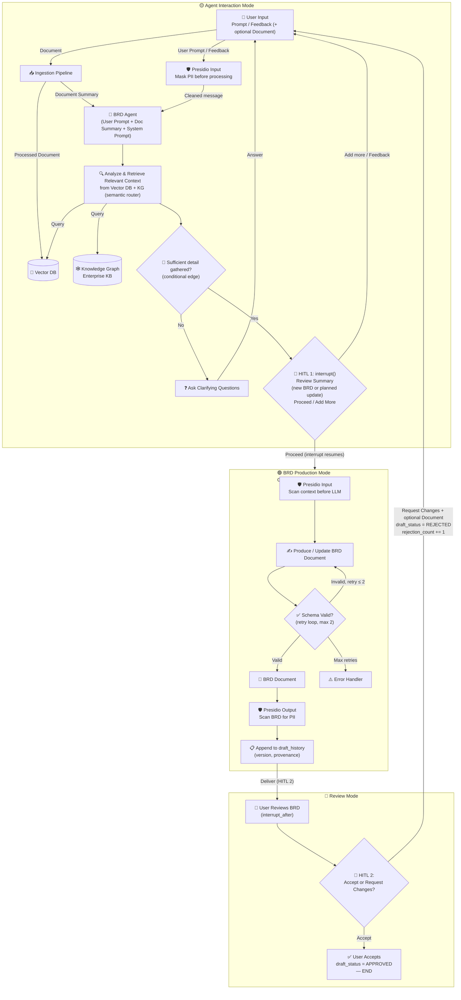
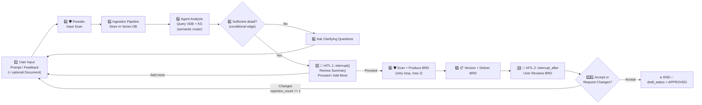

# BRD Agent Simplified Flow v2.0 (Chassis-Aligned)

## State-Based Flow Diagram

---

## Linear Step-by-Step (with HITL Gates + Guardrails)

---

## State Machine Table

| State | Purpose | Entry From | Exit To | HITL Gate |
|-------|---------|------------|---------|-----------|
| 🟡 **Agent Interaction** | Ingest & summarize document, analyze, retrieve from Vector DB + enterprise KG (semantic router), ask clarifying questions, collect review feedback. Presidio scans every message. Agent decides when enough detail is gathered. | User input / HITL1 (Add more) / Review changes | 🟢 BRD Production | **HITL 1** — `interrupt()` in `hitl_gate` node |
| 🟢 **BRD Production** | Generate initial BRD **or** update existing BRD atomically with complete gathered context. Validation retry loop (max 2). Presidio input/output guardrails. Draft appended to `draft_history`. | 🟡 Agent Interaction (HITL 1 approved) | 🔵 Review Mode / ⚠️ Error | Auto-transition via `interrupt_after` |
| 🔵 **Review Mode** | User reviews delivered BRD and decides to accept or request changes. `draft_status` tracked in state (not session flag). `rejection_count` incremented on changes. | 🟢 BRD Production | ✅ END (accept) / 🟡 Agent Interaction (changes) | **HITL 2** — `interrupt_after` on `schema_validate` |

---

## The Two HITL Gates (LangGraph Interrupts)

| Gate | Implementation | Location | Prompt | Outcome A | Outcome B |
|------|---------------|----------|--------|-----------|-----------| 
| **HITL 1** | `interrupt()` in `hitl_gate` node | 🟡 → 🟢 | *New BRD:* "Here's a summary of what I've gathered — add anything, or proceed?" · *Update:* "Based on your feedback, here's the update I'll make — proceed, or add more?" | `Proceed` → 🟢 BRD Production | `Add more` → stay in 🟡 |
| **HITL 2** | `interrupt_after=["schema_validate"]` | Inside 🔵 | *"Please review the BRD. Accept, or request changes?"* | `Accept` → ✅ END | `Request changes` → 🟡 (rejection_count += 1) |

---

## Key Design Rules

1. **🟡 Agent Interaction is the universal entry point** — initial prompts, clarifications, and review changes all enter here.
2. **🟢 Production is atomic** — BRD is produced/updated **once** per cycle with the complete gathered context. Multiple cycles are allowed.
3. **Feedback re-entry is not a separate mode** — it is the same Agent Interaction loop with the current draft in context. Ends at the same HITL 1 gate.
4. **HITL gates are LangGraph interrupts** (Chassis §3.2.2) — no ad-hoc branches. Graph pauses at SqliteSaver level.
5. **🟢 → 🔵 is auto** — Once production completes, it auto-delivers to Review Mode.
6. **Only 🔵 → 🟡 requires user action** — Requesting changes is the only backward transition.
7. **KG is pre-seeded enterprise KB** — KG/VDB are direct retriever calls, not MCP (Chassis §3.3.1).
8. **Presidio guardrails wrap every LLM call** (Chassis §3.5) — mask financial/contact PII; log person names.
9. **Every production cycle is versioned** — `draft_history` is append-only with full provenance.
10. **Rejection count tracked, no hard cap** — Production env will enforce Chassis §3.8 (3 rejections).