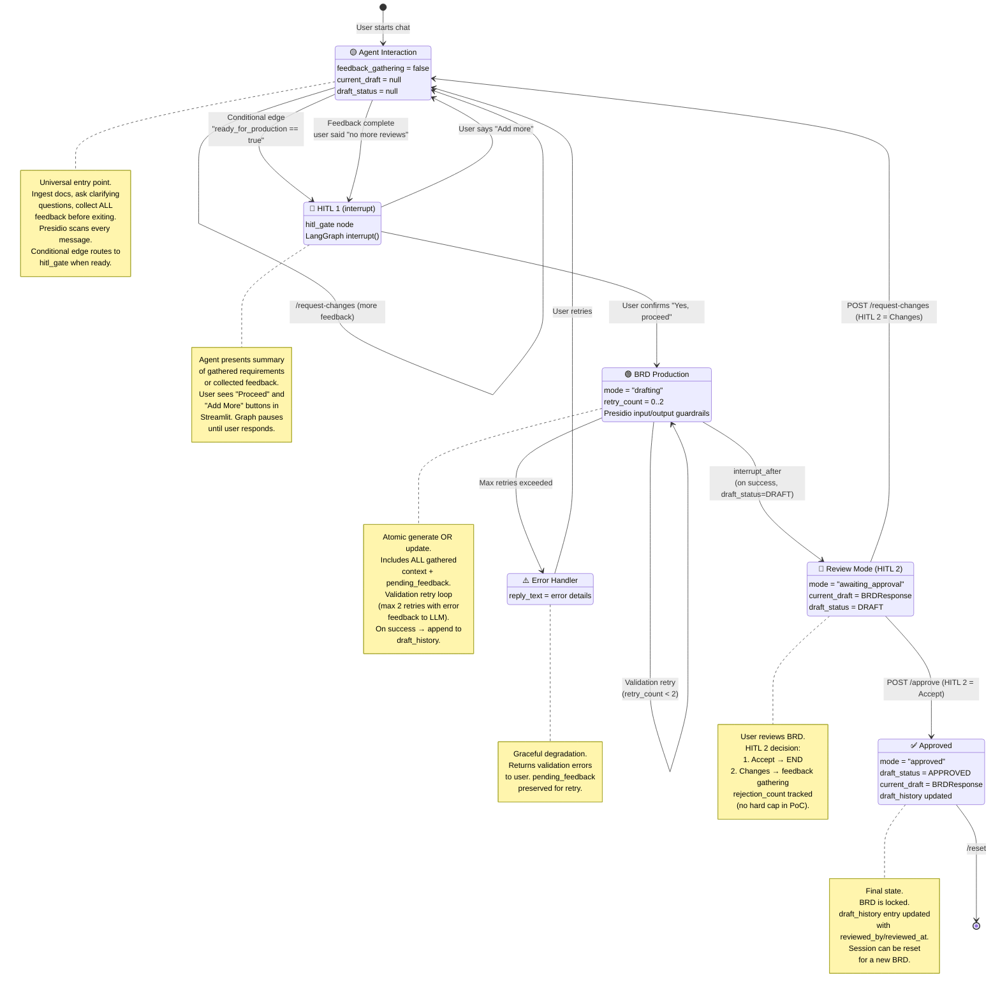

# State Flow Diagram — BRD Agent v2.0 (Chassis-Aligned)

This diagram models the BRD Agent as a **3-state machine** with **2 Human-in-the-Loop (HITL) gates** implemented as LangGraph interrupts. States are defined by `mode` + `feedback_gathering` + `current_draft` + `draft_status`.



## State Definition Table

A state is uniquely identified by the tuple: **(mode, feedback_gathering, current_draft, draft_status)**

| State Name | mode | feedback_gathering | current_draft | draft_status | Entry From | Exit To | HITL |
|---|---|---|---|---|---|---|---|
| **🟡 Agent Interaction** | `gathering` | `false` | `null` | `null` | `*` (start) / HITL1 (Add more) / ReviewMode (changes) | HITL1 (conditional edge) | — |
| **🟡 Agent Interaction (Feedback Sub-loop)** | `request_changes` | `true` | `BRDResponse` | `REJECTED` | ReviewMode (changes) | HITL1 (feedback complete) | — |
| **👤 HITL 1 (interrupt)** | `gathering` | `false` | `null` or `BRDResponse` | `null` or `REJECTED` | 🟡 Agent Interaction (`route_after_conversation`) | 🟢 Production (Proceed) / 🟡 Agent Interaction (Add more) | `interrupt()` in `hitl_gate` |
| **🟢 BRD Production** | `drafting` | `false` | `BRDResponse` (writing) | `null` | HITL1 (Proceed) | 🔵 Review (`interrupt_after`) / retry / error | — |
| **⚠️ Error Handler** | `drafting` | `false` | `null` | `null` | 🟢 Production (max retries) | 🟡 Agent Interaction (user retries) | — |
| **🔵 Review Mode (HITL 2)** | `awaiting_approval` | `false` | `BRDResponse` | `DRAFT` | 🟢 Production | ✅ Approved (accept) / 🟡 Agent Interaction (changes) | `interrupt_after` on `schema_validate` |
| **✅ Approved** | `approved` | `false` | `BRDResponse` | `APPROVED` | 🔵 Review (accept) | `*` (reset) | — |

## Design Rules

1. **🟡 Agent Interaction is the universal entry point** — initial prompts, clarifications, and review changes all enter here.
2. **🟢 Production is atomic per cycle** — Within each production cycle, the BRD is produced/updated **all at once** with the complete gathered context. Multiple cycles are allowed until the user is satisfied.
3. **Feedback re-entry is not a separate mode** — it is the same Agent Interaction loop, entered with the current draft in context. The user may attach supporting documents with feedback, and the loop ends at the same HITL 1 gate.
4. **HITL gates are LangGraph interrupts** (Chassis §3.2.2) — HITL 1 uses `interrupt()` inside `hitl_gate` node. HITL 2 uses `interrupt_after=[\"schema_validate\"]`. No ad-hoc branches.
5. **🟢 → 🔵 is auto** — Once production starts, it completes and auto-delivers to Review Mode. No user action needed mid-production.
6. **Only 🔵 → 🟡 requires user action** — Requesting changes from HITL 2 is the only backward transition triggered by the user.
7. **The Knowledge Graph is a pre-seeded enterprise KB** — Ingestion populates the Vector DB only; the agent reads enterprise context from the KG but does not write to it. KG/VDB are direct retriever calls, not MCP (Chassis §3.3.1).
8. **Presidio guardrails wrap every LLM call** — input and output. Financial/contact PII is masked; person names are logged but not masked.
9. **Every production cycle is versioned** — `draft_history` is append-only with full provenance.
10. **Rejection count tracked, no hard cap** — `rejection_count` increments on each `/request-changes`. Production env will enforce Chassis §3.8 (3 rejections → escalation).

## Draft Lifecycle with Versioning (v2)

```
null → HITL1(interrupt) → v1(DRAFT) → HITL2(interrupt_after) → REJECTED
                                                                    ↓
                                                              HITL1(interrupt)
                                                                    ↓
                                                              v2(DRAFT) → HITL2
                                                                    ↓
                                                              APPROVED
                                                              (draft_history[1].reviewed_by = "user")
```

**v2 change:** `current_draft` is still overwritten on re-generation, but `draft_history` preserves all versions with full provenance. Each entry captures prompt_hash, context_strategy, model, token_accounting, and review status.
